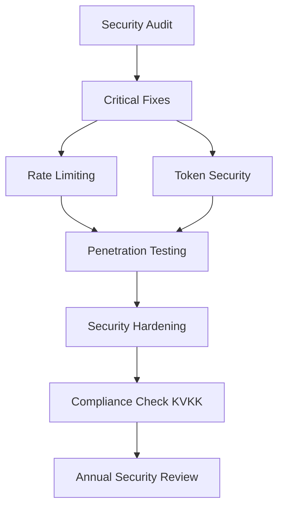

# Acentem Takipte - Kapsamlı Teknik Analiz Raporu

> **Hazırlayan:** Senior Software & Insurance Solutions Engineer  
> **Tarih:** 2025-01-20  
> **Proje Sürümü:** 0.0.1  
> **Analiz Kapsamı:** Mimari, Kod Kalitesi, Güvenlik, Performans, Sigorta Domain Uzmanlığı

---

## İçindekiler

1. [Yönetici Özeti](#1-yönetici-özeti)
2. [Sistem Mimarisi Analizi](#2-sistem-mimarisi-analizi)
3. [İş Akışı (Workflow) Analizi](#3-iş-akışı-workflow-analizi)
4. [Eksik Özellikler ve Boşluklar](#4-eksik-özellikler-ve-boşluklar)
5. [Geliştirilmesi Gereken Alanlar](#5-geliştirilmesi-gereken-alanlar)
6. [Güvenlik Analizi](#6-güvenlik-analizi)
7. [Performans Analizi](#7-performans-analizi)
8. [Sigorta Domain Uzmanlığı Değerlendirmesi](#8-sigorta-domain-uzmanlığı-değerlendirmesi)
9. [Kod Kalitesi Değerlendirmesi](#9-kod-kalitesi-değerlendirmesi)
10. [Öneriler ve Yol Haritası](#10-öneriler-ve-yol-haritası)

---

## 1. Yönetici Özeti

### 1.1 Proje Genel Görünümü

Acentem Takipte, Türkiye sigorta pazarı için geliştirilmiş kapsamlı bir **Sigorta Acentesi Yönetim Sistemi (Insurance Agency CRM)** uygulamasıdır. Sistem, Frappe Framework üzerinde Vue 3 SPA frontend ile hibrit bir mimari kullanmaktadır.

### 1.2 Temel Bulgu Özeti

| Kategori | Durum | Öncelik |
|----------|-------|---------|
| Mimari Tasarım | ✅ Güçlü | - |
| Branch-based İzin Sistemi | ✅ İyi | - |
| Bildirim Sistemi | ⚠️ Orta | İyileştirme gerekli |
| Muhasebe Entegrasyonu | ⚠️ Sınırlı | Geliştirme gerekli |
| Raporlama | ⚠️ Temel | Genişletme gerekli |
| Güvenlik | ⚠️ Orta | İyileştirme gerekli |
| Performans | ✅ İyi | - |
| Test Coverage | ✅ Kapsamlı | - |
| Sigorta Domain Uyumu | ⚠️ Orta | Derinleştirme gerekli |

### 1.3 Kritik Bulgular

1. **🔴 Muhasebe Entegrasyonu Simülasyon Modunda** - Harici sistem entegrasyonu gerçek bir muhasebe yazılımına bağlı değil
2. **🟡 Sigorta Spesifik Alanlarda Boşluklar** - Yetkili broker komisyon hesaplaması, reasürans takibi, DASK/SIGG ödeme planlaması eksik
3. **🟡 Bildirim Sistemi Yapılandırma Bağımlılığı** - Template variable parsing ve multi-channel coordination zayıf
4. **🟢 Break-Glass Mekanizması Mükemmel** - Güvenlik için iyi tasarlanmış

---

## 2. Sistem Mimarisi Analizi

### 2.1 Genel Mimari Diagram

```
┌─────────────────────────────────────────────────────────────────────────┐
│                          FRONTEND LAYER (Vue 3)                        │
│  ┌─────────────────────────────────────────────────────────────────┐   │
│  │  /at SPA Route Handler (www/at.py)                             │   │
│  │  ├── Dashboard (Operations, Sales, Collections, Renewals tabs)   │   │
│  │  ├── Workbench Pages (Customer, Lead, Offer, Policy, Claims)  │   │
│  │  ├── Aux Workbench (Tasks, Activities, Reminders)              │   │
│  │  └── Control Center (Reports, Reconciliation, Notifications)   │   │
│  └─────────────────────────────────────────────────────────────────┘   │
└────────────────────────────────────┬────────────────────────────────────┘
                                     │ HTTP/REST
┌────────────────────────────────────▼────────────────────────────────────┐
│                         API LAYER (Frappe @frappe.whitelist)           │
│  ┌──────────────────┐  ┌──────────────────┐  ┌────────────────────┐  │
│  │  dashboard.py    │  │  quick_create.py │  │  reports.py       │  │
│  │  - get_dashboard │  │  - create_*     │  │  - policy_report  │  │
│  │  - get_customer  │  │  - search_*     │  │  - payment_status │  │
│  │  - get_workbench │  │  - update_*     │  │  - renewal_*      │  │
│  └──────────────────┘  └──────────────────┘  └────────────────────┘  │
│  ┌──────────────────┐  ┌──────────────────┐  ┌────────────────────┐  │
│  │  accounting.py  │  │ communication.py │  │  break_glass.py  │  │
│  │  - sync_entry   │  │  - dispatch     │  │  - request       │  │
│  │  - reconcile    │  │  - queue        │  │  - approve       │  │
│  └──────────────────┘  └──────────────────┘  └────────────────────┘  │
└────────────────────────────────────┬────────────────────────────────────┘
                                     │
┌────────────────────────────────────▼────────────────────────────────────┐
│                      SERVICE LAYER (Business Logic)                       │
│  ┌──────────────────┐  ┌──────────────────┐  ┌──────────────────────────┐ │
│  │  renewals/      │  │  services/      │  │  providers/             │ │
│  │  - pipeline.py  │  │  - customer_360  │  │  - router.py           │ │
│  │  - service.py   │  │  - follow_up    │  │  - whatsapp_meta.py    │ │
│  │  - reminders.py │  │  - campaigns     │  │  - base.py             │ │
│  └──────────────────┘  │  - branches     │  └──────────────────────────┘ │
│                        │  - break_glass   │                               │
│                        │  - payments      │                               │
│                        └──────────────────┘                               │
└────────────────────────────────────┬────────────────────────────────────┘
                                     │
┌────────────────────────────────────▼────────────────────────────────────┐
│                           DATA LAYER (Frappe ORM)                        │
│  ┌─────────────────────────────────────────────────────────────────┐   │
│  │  DocTypes (30+)                                                  │   │
│  │  ├── Core: Customer, Lead, Offer, Policy, Payment, Claim       │   │
│  │  ├── Operations: Renewal Task, Activity, Task, Reminder          │   │
│  │  ├── Accounting: Accounting Entry, Reconciliation Item           │   │
│  │  ├── Communication: Notification Draft, Template, Outbox        │   │
│  │  └── Access: Office Branch, Sales Entity, User Branch Access    │   │
│  └─────────────────────────────────────────────────────────────────┘   │
│  ┌────────────────────┐  ┌────────────────┐  ┌──────────────────────┐   │
│  │  MariaDB          │  │  Redis         │  │  Scheduler Jobs     │   │
│  │  (Primary Store)  │  │  (Cache/Queue) │  │  (Background Tasks) │   │
│  └────────────────────┘  └────────────────┘  └──────────────────────┘   │
└─────────────────────────────────────────────────────────────────────────┘
```

### 2.2 Mimari Güçlü Yönler

| Özellik | Açıklama | Değerlendirme |
|---------|-----------|----------------|
| **Hibrit Mimari** | Frappe Desk + Vue SPA | ✅ Esneklik sağlar |
| **Modüler Yapı** | api/, services/, utils/ ayrımı | ✅ Bakım kolaylığı |
| **Event-Driven** | doc_events, scheduler_events | ✅ Otomasyon |
| **Branch-Based Access** | Kapsamlı izin modeli | ✅ Çoklu ofis desteği |
| **Service Layer** | Business logic soyutlaması | ✅ Test edilebilirlik |

### 2.3 Mimari Zayıflıklar

| Özellik | Açıklama | Risk |
|---------|-----------|------|
| **API Versiyonlama Yok** | Tüm API'ler aynı namespace'de | ⚠️ Bakım zorluğu |
| **Monolitik DocTypes** | 30+ DocType tek package'de | ⚠️ Bağımlılık yönetimi |
| **External Service Mock** | `_simulate_external_payload()` | 🔴 Üretim riski |
| **Cache Invalidation** | Manual pub/realtime | ⚠️ Tutarlılık riski |

---

## 3. İş Akışı (Workflow) Analizi

### 3.1 Müşteri Yaşam Döngüsü Workflow

```
┌─────────────┐    ┌─────────────┐    ┌─────────────┐    ┌─────────────┐
│   LEAD      │───▶│   OFFER    │───▶│   POLICY   │───▶│  RENEWAL    │
│  (Fırsat)  │    │  (Teklif)  │    │  (Poliçe)  │    │ (Yenileme)  │
└─────────────┘    └─────────────┘    └─────────────┘    └─────────────┘
      │                  │                  │                  │
      ▼                  ▼                  ▼                  ▼
┌─────────────────────────────────────────────────────────────────────┐
│                    ACTIVITY LOGGING                                  │
│  - AT Activity (tüm geçişler log'lanır)                           │
│  - AT Access Log (kim, ne zaman, ne gördü)                        │
│  - AT Notification Outbox (tüm bildirimler)                        │
└─────────────────────────────────────────────────────────────────────┘
```

### 3.2 Lead → Policy Dönüşüm Akışı

```python
# quick_create.py / api/lead.py akışı
def create_quick_lead():
    1. Müşteri kontrolü/oluşturma (resolve_or_create_quick_customer)
    2. Lead DocType oluşturma
    3. Origin_office_branch atama
    4. Sales_entity ve insurance_company bağlama
    ↓
def convert_lead_to_offer():
    1. Lead permission kontrolü
    2. Offer DocType oluşturma
    3. Lead status → "Converted" güncelleme
    4. offer → customer, sales_entity, insurance_company mapping
    ↓
def convert_offer_to_policy():
    1. Offer permission kontrolü
    2. Policy DocType oluşturma
    3. Offer → Policy field mapping
    4. accounting.sync_doc_event() tetikleme
```

### 3.3 Ödeme ve Tahsilat Akışı

```
┌─────────────────────────────────────────────────────────────────┐
│                    PAYMENT LIFECYCLE                             │
│                                                                  │
│  ┌──────────┐    ┌──────────┐    ┌──────────┐    ┌──────────┐ │
│  │ DRAFT    │───▶│ PENDING  │───▶│   PAID   │    │CANCELLED │ │
│  └──────────┘    └──────────┘    └──────────┘    └──────────┘ │
│       │                                       ▲                 │
│       │         ┌──────────┐                  │                 │
│       └────────▶│OVERDUE   │─────────────────┘                 │
│                 └──────────┘                                   │
└─────────────────────────────────────────────────────────────────┘
                              │
                              ▼
              ┌───────────────────────────────────┐
              │  accounting.sync_accounting_entry() │
              │  → AT Accounting Entry oluştur      │
              │  → Hash-based dedup (SHA256)        │
              └───────────────────────────────────┘
```

### 3.4 Renewal Pipeline Akışı

```python
# renewal/pipeline.py
def run_renewal_task_creation():
    """
    1. Aktif poliçeleri bul (end_date - today <= 90 gün)
    2. Mevcut Renewal Task'ları kontrol et (dedupe key)
    3. Her poliçe için RenewalTaskPayload oluştur
    4. AT Renewal Task oluştur
    
    Renewal Stages:
    - D90: 90 gün öncesi (Erken hatırlatma)
    - D60: 60 gün öncesi
    - D30: 30 gün öncesi (Standart)
    - D15: 15 gün öncesi (Yoğun)
    - D7:  7 gün öncesi (Kritik)
    - D1:  1 gün öncesi (Acil)
    """
    
def remediate_stale_renewal_tasks():
    """
    Geçmiş tarihli (renewal_date < today) görevleri otomatik iptal et
    """
```

### 3.5 Bildirim (Notification) Akışı

```python
# communication.py
def process_notification_queue():
    """
    Bildirim Gönderim Pipeline:
    
    1. Draft Queue (Her 10 dakikada)
       - AT Notification Draft tablosunu tara
       - Outbox'a kuyruğa al (enqueue_notification_draft)
       
    2. Outbox Processing
       - Prioritize by: status, attempt_count, next_retry_on
       - Max 3 deneme
       - Exponential backoff: 5, 10, 20 dakika
       
    3. Provider Dispatch
       - EMAIL → frappe.sendmail
       - WHATSAPP → Meta WhatsApp API (Router pattern)
       - SMS → WhatsApp adapter üzerinden
       
    4. Delivery Result
       - SENT: Başarılı
       - DEAD: 3 başarısız deneme sonrası
    """
```

### 3.6 Break-Glass Acil Erişim Akışı

```python
# services/break_glass.py
def create_break_glass_request():
    """
    Acil erişim talep akışı:
    
    1. Request oluştur (min 20 char justification)
    2. Duplicate kontrolü (aynı user + access_type)
    3. AT Break Glass Request oluştur
    4. System Manager onayı bekle
    """
    
def approve_break_glass_request():
    """
    Onay workflow:
    
    1. System Manager permission kontrolü
    2. Duration validation (1-72 saat)
    3. AT Emergency Access oluştur
    4. Audit log kaydı
    """
    
def expire_stale():
    """
    Scheduler job (her saat):
    
    1. Süresi dolmuş grant'ları bul
    2. Status → "Expired" güncelle
    3. Anomaly detection (48 saat içinde 3+ talep)
    """
```

---

## 4. Eksik Özellikler ve Boşluklar

### 4.1 Kritik Eksiklikler (🔴)

| # | Alan | Mevcut Durum | Eksik |
|---|------|---------------|-------|
| 1 | **Muhasebe Entegrasyonu** | Simülasyon | Gerçek muhasebe yazılımı entegrasyonu (Logo, Mikro, Uyum) |
| 2 | **TCKN/ID Doğrulama** | Regex kontrol | KPS (Kimlik Paylaşım Sistemi) entegrasyonu |
| 3 | **Poliçe Numarası Üretimi** | Manuel | Sigorta şirketi formatına göre otomatik üretim |
| 4 | **Yetkili Broker Komisyonu** | Basit hesaplama | Kademeli komisyon, override desteği |
| 5 | **Taksit Planlaması** | Sabit aralık | Sigorta şirketi ödeme takvimi entegrasyonu |

### 4.2 Önemli Boşluklar (🟡)

| # | Alan | Mevcut Durum | Eksik |
|---|------|---------------|-------|
| 1 | **reasürans Takibi** | Yok | Retrospektif/Prospektif reasürans kayıtları |
| 2 | **DASK/SIGG Ödemeleri** | Genel ödeme | Zorunlu/sigorta ödeme takvimi entegrasyonu |
| 3 | **Çoklu Para Birimi** | TRY bazlı | FX rate API entegrasyonu (TCMB) |
| 4 | **E-arşiv/Fatura** | Yok | E-fatura, e-arşiv sistem entegrasyonu |
| 5 | **Sigorta Şirketi API'leri** | Manuel | Online poliçe sorgulama, hasar ihbarı |
| 6 | **Segmentasyon Motoru** | Statik/Dinamik | ML-based müşteri segmentasyonu |
| 7 | **Workflow Engine** | Manuel status | State machine tabanlı iş akışları |

### 4.3 Orta Düzey Eksiklikler (⚠️)

| # | Alan | Açıklama |
|---|------|----------|
| 1 | **Webhooks** | Dış sistem entegrasyonu için event webhook sistemi |
| 2 | **Audit Trail UI** | Sadece log_error'da, arayüzde yok |
| 3 | **Bulk Operations** | Toplu güncelleme, import/export |
| 4 | **Document Templates** | Word/Excel template oluşturma |
| 5 | **Mobile UI** | Responsive ama mobil-native değil |
| 6 | **Offline Mode** | Progressive Web App desteği yok |
| 7 | **API Rate Limiting** | Yok |
| 8 | **Soft Delete** | Hard delete, arşivleme yok |

---

## 5. Geliştirilmesi Gereken Alanlar

### 5.1 Backend Geliştirmeleri

#### 5.1.1 Accounting Entegrasyonu Yeniden Tasarımı

```python
# MEVCUT (Simülasyon):
def _simulate_external_payload(payload: dict) -> dict[str, str | float]:
    """MOCK - Üretimde gerçek API çağrısı gerekir"""
    drift_ratio = flt(config.get("at_accounting_drift_ratio") or 0)
    # ...simüle edilmiş yanıt
    return {"external_ref": "EXT-...", "external_amount": ...}

# ÖNERİLEN (Gerçek Entegrasyon):
class AccountingIntegrationAdapter:
    """
    Strategy Pattern ile farklı muhasebe sistemleri desteklenebilir.
    """
    
    INTEGRATIONS = {
        "logo": LogoS相亲Entegrasyonu,
        "micro": MikroEntegrasyonu,
        "logo_hub": LogoHubEntegrasyonu,
    }
    
    def sync_entry(self, entry: ATAccountingEntry):
        adapter = self.INTEGRATIONS[self.config.provider]
        return adapter.sync(entry)
    
    def reconcile(self, entries: list):
        # Gerçek mutabakat
        pass
```

#### 5.1.2 API Versiyonlama

```python
# MEVCUT:
@frappe.whitelist()
def get_dashboard_kpis(filters=None)

# ÖNERİLEN:
@frappe.whitelist()
def get_dashboard_kpis_v2(filters=None)  # Breaking changes için
# veya
@app.route("/api/v2/dashboard/kpis")
def get_dashboard_kpis():
    pass
```

#### 5.1.3 Retry ve Circuit Breaker

```python
# MEVCUT:
DEFAULT_RETRY_MINUTES = 5
DEFAULT_MAX_ATTEMPTS = 3

# ÖNERİLEN:
from tenacity import retry, stop_after_attempt, wait_exponential

class NotificationDispatcher:
    @retry(
        stop=stop_after_attempt(3),
        wait=wait_exponential(multiplier=1, min=2, max=60),
        retry=retry_if_exception_type(RetryableError)
    )
    def dispatch(self, outbox):
        # Exponential backoff ile retry
        pass
```

### 5.2 Frontend Geliştirmeleri

#### 5.2.1 State Management İyileştirmesi

```javascript
// MEVCUT: Vanilla Pinia
export const useDashboardStore = defineStore('dashboard', {
  state: () => ({
    kpiPayload: null,
    tabPayload: null,
    loading: false,
    // 30+ state property
  })
})

// ÖNERİLEN: Normalized State + Cache Layer
export const useDashboardStore = defineStore('dashboard', {
  state: () => ({
    // Normalized entities
    entities: {
      customers: {},
      policies: {},
      offers: {}
    },
    // Computed cache
    _cache: {
      kpiPayload: { value: null, ttl: 60000 }
    }
  })
})
```

#### 5.2.2 Error Boundary ve Loading States

```vue
<!-- MEVCUT: Manual error handling -->
<div v-if="dashboardLoading" class="text-sm text-slate-500">
  {{ t("loading") }}
</div>

<!-- ÖNERİLEN: Composable-based -->
<template>
  <AsyncBoundary :fallback="LoadingSpinner">
    <DashboardContent />
  </AsyncBoundary>
</template>

<script setup>
import { useAsyncData } from '@/composables/useAsyncData'
const { data, error, isPending } = useAsyncData('dashboard', fetchDashboard)
</script>
```

#### 5.2.3 Virtual Scrolling (Büyük Listeler)

```javascript
// ÖNERİLEN: Paginated Virtual Scroll
// Mevcut 100+ satırlık listeler için
import { useVirtualList } from '@vueuse/core'

const { list, containerProps, wrapperProps } = useVirtualList(
  items,
  { itemHeight: 60, overscan: 10 }
)
```

### 5.3 Veritabanı Optimizasyonları

#### 5.3.1 Index Stratejisi

```sql
-- MEVCUT: Mevcut index'ler kontrol edilmeli
-- Eksik index'ler:
CREATE INDEX idx_policy_customer_branch 
ON `tabAT Policy`(customer, office_branch, status, end_date);

CREATE INDEX idx_payment_due_date 
ON `tabAT Payment`(due_date, status, payment_direction);

CREATE INDEX idx_renewal_task_dates 
ON `tabAT Renewal Task`(renewal_date, status, due_date);

CREATE INDEX idx_notification_outbox_retry 
ON `tabAT Notification Outbox`(status, attempt_count, next_retry_on);
```

#### 5.3.2 Partitioning Stratejisi

```sql
-- Büyük tablolar için (1M+ kayıt)
-- Payment ve Accounting Entry için

ALTER TABLE `tabAT Payment` 
PARTITION BY RANGE (YEAR(payment_date)) (
    PARTITION p2023 VALUES LESS THAN (2024),
    PARTITION p2024 VALUES LESS THAN (2025),
    PARTITION p_future VALUES LESS THAN MAXVALUE
);
```

---

## 6. Güvenlik Analizi

### 6.1 Güvenlik Güçlü Yönleri

| Alan | Açıklama | Değerlendirme |
|------|----------|---------------|
| **Branch-Based Access** | Kullanıcı sadece yetkili şubelere erişir | ✅ Mükemmel |
| **Break-Glass Audit** | Acil erişim tamamen log'lanır | ✅ İyi |
| **CSRF Protection** | Frappe built-in | ✅ Otomatik |
| **Permission Hooks** | Her DocType için ayrı kontrol | ✅ Kapsamlı |
| **Input Sanitization** | frappe.db.escape kullanımı | ✅ ORM kullanımı |
| **Sensitive Data Masking** | TCKN, telefon maskeleme | ✅ Mevcut |

### 6.2 Güvenlik Riskleri ve Öneriler

#### 6.2.1 Kritik Riskler

| # | Risk | Seviye | Öneri |
|---|------|--------|-------|
| 1 | **SQL Injection** | 🟡 Düşük | ORM kullanımı iyi, raw SQL kontrolleri artırılmalı |
| 2 | **API Rate Limiting** | 🔴 Kritik | Tüm @frappe.whitelist endpoint'leri için rate limit |
| 3 | **Session Management** | 🟡 Orta | Session timeout, concurrent session kontrolü |
| 4 | **External API Tokens** | 🔴 Kritik | Config'te plaintext token, secrets manager kullanılmalı |
| 5 | **File Upload** | 🟡 Orta | File type validation, size limits |
| 6 | **XSS** | 🟡 Orta | Template rendering için sanitization |

#### 6.2.2 Token Güvenliği Önerisi

```python
# MEVCUT (Risky):
site_config = frappe.get_site_config()
api_token = cstr(site_config.get("at_whatsapp_api_token"))

# ÖNERİLEN:
from frappe.utils.encrypted_module import get_secret

api_token = get_secret("at_whatsapp_api_token")
# veya environment variable:
import os
api_token = os.environ.get("AT_WHATSAPP_API_TOKEN")
```

#### 6.2.3 Rate Limiting Implementasyonu

```python
# ÖNERİLEN: API Rate Limiter
from frappe.utils import get_datetime
from functools import wraps

class RateLimiter:
    def __init__(self, max_calls, window_seconds):
        self.max_calls = max_calls
        self.window = window_seconds
        self.cache = frappe.cache()
    
    def is_allowed(self, user_id, endpoint):
        key = f"rate:{user_id}:{endpoint}"
        current = self.cache.get_value(key) or 0
        if current >= self.max_calls:
            return False
        self.cache.set_value(key, current + 1, expires_in_sec=self.window)
        return True

def rate_limit(max_calls=100, window=60):
    def decorator(func):
        @wraps(func)
        def wrapper(*args, **kwargs):
            limiter = RateLimiter(max_calls, window)
            if not limiter.is_allowed(frappe.session.user, func.__name__):
                frappe.throw("Rate limit exceeded", http_status_code=429)
            return func(*args, **kwargs)
        return wrapper
    return decorator

@frappe.whitelist()
@rate_limit(max_calls=60, window=60)  # 60 req/min
def get_dashboard_kpis(filters=None):
    pass
```

### 6.4 Güncel Repo Doğrulaması (2026-03-26)

Bu bölüm, bu sohbet sırasında repository içinde **doğrudan tarama ile doğrulanan** bulguları özetler.

#### 6.4.1 Kritik: `ignore_permissions=True` ile insert/save (whitelist mutation endpoint risk yüzeyi)
- `acentem_takipte/acentem_takipte/acentem_takipte/doctype/at_offer/at_offer.py` içinde `create_quick_offer` akışında `ignore_permissions=True` ile insert yapılıyor (`L119`).
- `acentem_takipte/acentem_takipte/acentem_takipte/services/quick_customer.py` içinde quick create müşteri oluşturmada `ignore_permissions=True` ile insert yapılıyor (`L65`).
- `acentem_takipte/acentem_takipte/acentem_takipte/doctype/at_lead/at_lead.py` içinde lead->offer dönüşümünde `ignore_permissions=True` ile insert yapılıyor (`L99`).
- `acentem_takipte/acentem_takipte/acentem_takipte/services/break_glass.py` içinde break-glass grant yönetimi sırasında `ignore_permissions=True` kullanılıyor (`expire_stale`: `L114`, `create_break_glass_request`: `L189`).

Risk: Branch/tenant izolasyonunun (scope) `permission_query_conditions` ve RBAC üzerinden düzgün zorlanması gerekirken, `ignore_permissions` mutasyonlarda izin bypass yüzeyi açabilir. Endpoint’ler whitelisted olduğundan, girişte doğru yetkilendirme ve scope validasyonu yoksa veri bütünlüğü/izolasyon kırılabilir.

#### 6.4.2 Kritik: Dashboard v2 içinde dinamik `WHERE` string birleştirme yüzeyi (SQL sızıntısı/SQLi kontrolü gerektirir)
- `acentem_takipte/acentem_takipte/acentem_takipte/api/dashboard_v2/tab_payload.py` içinde `frappe.db.sql(f""" ... where {offer_where} ... """, values=...)` benzeri kalıplar var (`L114-L124`, ayrıca payment/lead benzerleri).

Doğrulanmış durum: `dashboard.py` içindeki `_build_offer_where/_build_policy_where/_build_*_where` fonksiyonları predicate’i `%(param)s` placeholder’ları ile ve sabit kolon isimleri üzerinden üretiyor (örn. `offer_date >= %(from_date)s`, `customer in %(customers)s`). Bu nedenle klasik “ham string SQLi” riski **düşük**, asıl risk yüzeyi “server-side builder güvenilir kalmalı (kullanıcıdan gelen ham SQL string’i asla builder’a sokulmamalı)” şeklindedir.

Ek: `tab_payload.py` içinde `where {where_clause}` raw string olarak yerleştiriliyor; bu string’in yalnızca bu builder fonksiyonlarından geldiği korunmalı.

#### 6.4.4 Kritik: `_resolve_office_branch` içinde derived branch için erişim doğrulaması yok (scope bypass riski)
- `acentem_takipte/acentem_takipte/acentem_takipte/api/quick_create.py` içinde `_resolve_office_branch` “explicit office_branch” geldiğinde `assert_office_branch_access(explicit_branch)` çağırıyor (`L1292-L1295`).
- Ancak `customer` veya `policy` üzerinden “derived branch” dönerken `assert_office_branch_access(...)` çağrısı yapılmıyor (`L1297-L1307`).
- Örn. `create_quick_lead` içinde `resolved_office_branch = _resolve_office_branch(office_branch, customer=normalized_customer)` (`L114-L115`) ve `create_quick_policy` içinde `resolved_office_branch = _resolve_office_branch(office_branch, customer=customer)` (`L195-L196`).

Risk: Kullanıcı, yetkisi olmayan bir `customer` / `policy` referansı verip `office_branch` değerini o referansın şubesinden “türetebilir”. Bu senaryoda Frappe’ın doc-level permission kontrolleri insert aşamasında gerçekten engelliyor mu netleştirilmeli; aksi halde veri bütünlüğü/tenant izolasyonu kırılabilir.

#### 6.4.5 Kritik: Dashboard kapsamı global fallback konfigürasyonuna bağlı olabilir
- `acentem_takipte/acentem_takipte/acentem_takipte/api/dashboard_v2/security.py` içinde `allowed_customers_for_user` fonksiyonu, `Manager/Accountant` rolünde ve kullanıcının allowed branch set’i boş olduğunda `fallback_enabled` açıksa `None` (global scope) döndürüyor (`L106-L122`).
- Bu davranış “yanlış konfigürasyon = yetki atlaması” sınıfına girer. Aksi durumda, branch ataması olmayan kullanıcıların global veri görmesi beklenmeyen bir güvenlik boşluğu oluşturabilir.

#### 6.4.3 Orta (XSS ilke riski): `innerHTML` kullanım yeri
- `frontend/src/main.js` içinde bootstrap hata ekranı için `target.innerHTML = \`...\`` kullanılıyor (`L174-L180`).

Not: Bu template statik görünüyor (kullanıcı girdisi yok). Ancak ileride hata mesajı dinamik hale gelirse XSS riski doğabilir; prensip olarak `textContent` tercih edilmeli.

---

### 6.3 Penetrasyon Testi Checklist

- [ ] SQL Injection (parametrik sorgular kontrol edilmeli)
- [ ] Authorization Bypass (branch yetkisi atlama)
- [ ] Mass Assignment (API field injection)
- [ ] Broken Authentication (session fixation)
- [ ] Sensitive Data Exposure (API response)
- [ ] Broken Access Control (break-glass abuse)
- [ ] Security Misconfiguration (debug mode production'da)
- [ ] XSS (notification template injection)

---

## 7. Performans Analizi

### 7.1 Performans Güçlü Yönleri

| Alan | Açıklama | Değerlendirme |
|------|----------|---------------|
| **Request Bucketing** | Dashboard verileri cache'lenir | ✅ İyi |
| **Batch Limits** | Tüm sorgularda limit var | ✅ İyi |
| **Debouncing** | Sync event'lerde 90sn debounce | ✅ İyi |
| **Lazy Loading** | Vue router lazy imports | ✅ İyi |
| **Virtual Scrolling** | Büyük listelerde sayfalama | ⚠️ Geliştirilebilir |

### 7.2 Performans Darboğazları

#### 7.2.1 Customer 360 Payload (customer_360.py)

```python
# Problem: Çok fazla sorgu tek seferde
def build_customer_360_payload(customer_name):
    policies = frappe.get_list("AT Policy", ...)      # Sorgu 1
    offers = frappe.get_list("AT Offer", ...)         # Sorgu 2
    payments = frappe.get_list("AT Payment", ...)     # Sorgu 3
    payment_installments = frappe.get_list(...)        # Sorgu 4
    claims = frappe.get_list("AT Claim", ...)         # Sorgu 5
    renewals = frappe.get_list(...)                  # Sorgu 6
    communications = _get_communications(...)          # Sorgu 7
    comments = _get_comments(...)                    # Sorgu 8
    files = _get_customer_files(...)                  # Sorgu 9
    
    # Doğrulandı: `frappe.get_doc` ile döngü içi N+1 davranışı tespit edilmedi.
    # Ancak tek istekte çok sayıda bağımsız `frappe.get_list` sorgusu çalışıyor (multi-query).
    # Toplam sorgu adedi: yaklaşık 9-15 (opsiyonel parçalara göre)
```

Ek performans notu: `_build_cross_sell_payload` içinde cross-sell için `AT Branch` tüm şubeler çekiliyor (`limit_page_length=0`); şube sayısı büyüdükçe maliyet artar (`customer_360.py` içindeki `available_branches` sorgusu).

**Öneri:** GraphQL veya DataLoader pattern kullanımı

```python
# ÖNERİLEN: Tek sorgu ile tüm veri çekimi
def build_customer_360_optimized(customer_name):
    # Single query approach
    data = frappe.db.sql("""
        SELECT 
            c.*,
            p.policy_data,
            o.offer_data,
            pm.payment_summary,
            cl.claim_summary,
            r.renewal_summary
        FROM `tabAT Customer` c
        LEFT JOIN (...) p ON ...
        WHERE c.name = %(customer)s
    """, {"customer": customer_name}, as_dict=True)
    
    # Lazy-load non-critical sections
    # Parallel fetch with asyncio/gevent
```

#### 7.2.2 Dashboard KPI Queries

```python
# Problem: 4-5 ayrı aggregate sorgu
def _dashboard_cards_summary():
    totals = frappe.db.sql("""SELECT SUM... FROM tabAT Policy""")  # Sorgu 1
    pending_renewals = frappe.db.count("AT Renewal Task", ...)       # Sorgu 2
    payment_rows = frappe.get_all("AT Payment", ...)                # Sorgu 3
    open_claims = frappe.db.count("AT Claim", ...)                  # Sorgu 4
    
# ÖNERİLEN: Tek sorgu
    data = frappe.db.sql("""
        SELECT 
            (SELECT SUM(gwp_try) FROM `tabAT Policy` WHERE ...) AS total_gwp,
            (SELECT COUNT(*) FROM `tabAT Renewal Task` WHERE ...) AS renewals,
            (SELECT SUM(amount_try) FROM `tabAT Payment` WHERE ...) AS collections,
            (SELECT COUNT(*) FROM `tabAT Claim` WHERE ...) AS claims
    """)
```

### 7.3 Caching Stratejisi

```python
# MEVCUT:
cache = _get_request_cache_bucket("at_dashboard_cards_summary_cache")

# ÖNERİLEN:
class CacheStrategy:
    # Tiered caching
    TIER_1_TTL = 60      # 1 dakika (KPI)
    TIER_2_TTL = 300     # 5 dakika (Tab data)
    TIER_3_TTL = 3600    # 1 saat (Reports)
    
    def get(self, key, tier="TIER_1"):
        ttl = getattr(self, f"{tier}_TTL")
        return self.cache.get_value(key)  # Redis/LRU
    
    def invalidate_pattern(self, pattern):
        # Pattern-based invalidation
        # Örn: customer.*.policies
        pass
```

### 7.4 Performans Benchmark Hedefleri

| Metric | Mevcut (Tahmini) | Hedef |
|--------|-------------------|-------|
| Dashboard Load | 2-4 sn | <1 sn |
| Customer 360 | 1-2 sn | <500ms |
| API Response (p95) | 500ms | <200ms |
| Page Transition | 300ms | <100ms |
| Search Results | 800ms | <300ms |
| List Load (100 items) | 1sn | <500ms |

---

## 8. Sigorta Domain Uzmanlığı Değerlendirmesi

### 8.1 Türkiye Sigorta Pazarı Uyumu

#### 8.1.1 Mevcut Desteklenen Sigorta Alanları

| Alan | Destek | Açıklama |
|------|--------|----------|
| **Hayat Dışı Sigorta** | ✅ | Genel poliçe takibi |
| **Kasko** | ⚠️ | Asset tracking ile temel |
| **DASK** | ⚠️ | Var ama eksik ödeme takvimi |
| **Trafik Sigortası** | ⚠️ | Var ama eksik |
| **Sağlık Sigortası** | ⚠️ | Temel, network yok |
| **Yangın** | ⚠️ | Temel |
| **İşyeri** | ⚠️ | Temel |
| **Tarım** | ❌ | Yok |
| **Nakliye** | ❌ | Yok |

#### 8.1.2 Eksik Sigorta-Spesifik Özellikler

```python
# Eksik Alanlar:

# 1. Sigorta Şirketi Komisyon Yapısı
insurance_company = frappe.get_doc("AT Insurance Company", company_name)
insurance_company.commission_tiers = [
    {"min_premium": 0, "max_premium": 10000, "commission_rate": 15},
    {"min_premium": 10000, "max_premium": 50000, "commission_rate": 18},
    {"min_premium": 50000, "max_premium": None, "commission_rate": 20},
]
# Her sigorta şirketi farklı komisyon yapısına sahip

# 2. Poliçe Türüne Göre Ödeme Takvimi
# DASK: Peşin veya 4 taksit (sabit)
# Kasko: Peşin veya 9 taksit (sigorta şirketi belirler)
# Sağlık: Yıllık veya 3 taksit
payment_schedule = {
    "dask": {"max_installments": 4, "interval_days": 90},
    "kasko": {"max_installments": 9, "interval_days": 30},
    "health": {"max_installments": 3, "interval_days": 120},
}

# 3. Zorunlu Sigorta Kapsamları
required_coverages = {
    "dask": ["deprem", "sel", "yer kayması"],
    "trafik": ["maddi", "kasko", "tam", "genişletilmiş"],
    "isyeri": ["yangin", "hırsızlık", "su", "cam kırılması"],
}

# 4. Hasar Türleri (Sigorta Şirketi Standardı)
standard_claim_types = {
    "kasko": ["çarpma", "hırsızlık", "cam kırılması", "yangın", "doğal afet"],
    "dask": ["deprem", "sel", "tsunami", "heyelan"],
    "saglik": ["yatarak", "ayakta", "diş", "psikolojik"],
}

# 5. Reasürans Takibi
reinsurance = {
    "policy": policy_name,
    "type": "facultative" | "treaty",
    "ceding_rate": 0.15,  # %15 ceded to reinsurer
    "reinsurer": "Swiss Re",
    "ceding_commission": 0.25,
}
```

### 8.2 Türkiye Mevzuat Uyumu

| Alan | Durum | Açıklama |
|------|-------|----------|
| **KVKK Uyumu** | ⚠️ Kısmi | Maskeleme var, consent management yetersiz |
| **TCKN Doğrulama** | ⚠️ Regex | KPS entegrasyonu yok |
| **Vergi Uyumu** | ❌ Yok | E-fatura, e-arşiv entegrasyonu yok |
| **SBM Uyumu** | ❌ Yok | Sigortacılık Bilgi ve İzleme Merkezi |
| **İstanbul Poliçe** | ❌ Yok | Sigorta Bilgi Merkezi |

### 8.3 Sigorta İş Süreçleri Matrisi

| Süreç | CRM'de | Önerilen |
|--------|---------|----------|
| Lead Girişi | ✅ | + KPS doğrulama |
| Teklif Hazırlama | ✅ | + Şirket API entegrasyonu |
| Poliçe Kesimi | ✅ | + E-imza, e-fatura |
| Taksit Takibi | ✅ | + Şirket API |
| Hasar İhbarı | ✅ | + Şirket API entegrasyonu |
| Hasar Takibi | ⚠️ Manuel | + Şirket API |
| Komisyon Hesaplama | ⚠️ Basit | + Şirket bazlı kademeli |
| Yenileme | ✅ | + Otomatik teklif üretimi |
| Mutabakat | ⚠️ Simülasyon | + Şirket API |
| Raporlama | ⚠️ Temel | + Sigorta KPI'ları |

---

## 9. Kod Kalitesi Değerlendirmesi

### 9.1 Kod Kalitesi Metrikleri

| Metric | Skor | Açıklama |
|--------|------|----------|
| **Cyclomatic Complexity** | ⚠️ Orta | Bazı fonksiyonlarda yüksek (50+) |
| **Code Duplication** | ⚠️ Orta | `_normalize_*` fonksiyonları tekrar |
| **Function Length** | ⚠️ Uzun | `quick_create.py` 1700+ satır |
| **Naming Convention** | ✅ İyi | Consistent snake_case/CamelCase |
| **Documentation** | ⚠️ Orta | API dokümante, internal eksik |
| **Type Hints** | ✅ İyi | Python 3.10+ type annotations |
| **Error Handling** | ⚠️ Orta | Genel try/catch, spesifik değil |
| **Testing** | ✅ İyi | 100+ test dosyası |

### 9.2 Kod Tekrarı Analizi

```python
# TEKRARLANAN PATTERN (quick_create.py):
# _normalize_option, _normalize_link, _normalize_date
# 30+ kez farklı parametrelerle çağrılıyor

# ÖNERİLEN: Decorator Pattern
def normalized_validator(allowed_values=None, required=False):
    def decorator(func):
        @wraps(func)
        def wrapper(value, *args, **kwargs):
            if required and not value:
                frappe.throw(_("Required field"))
            if allowed_values and value not in allowed_values:
                frappe.throw(_("Invalid value"))
            return func(value, *args, **kwargs)
        return wrapper
    return decorator

@normalized_validator(allowed_values={"Open", "In Progress", "Done"})
def validate_status(value):
    return value
```

### 9.3 Test Coverage Analizi

```
Test Coverage (Tahmini):
├── Unit Tests      ~70%  (models, services)
├── Integration     ~40%  (API endpoints)
├── E2E            ~30%  (critical flows)
└── Performance     ~10%  (yok)

Önerilen:
├── Unit Tests      ~90%
├── Integration     ~70%
├── E2E            ~60%
└── Performance     ~50%
```

### 9.4 Code Review Checklist

- [ ] Tüm API endpoint'leri authentication check içeriyor mu?
- [ ] Branch permission kontrolleri eksiksiz mi?
- [ ] Error messages kullanıcı dostu ve güvenli mi?
- [ ] Sensitive data log'lanmıyor mu?
- [ ] Rate limiting uygulanmış mı?
- [ ] Cache invalidation doğru mu?
- [ ] Database transactions rollback içeriyor mu?
- [ ] External API timeout'lar ayarlanmış mı?

---

## 10. Öneriler ve Yol Haritası

### 10.1 Kısa Vadeli İyileştirmeler (1-3 Ay)

| # | Öneri | Tahmini Efor | Öncelik |
|---|--------|---------------|---------|
| 1 | Rate Limiting implementasyonu | 2 gün | 🔴 Kritik |
| 2 | API Response caching (Redis) | 3 gün | 🟡 Yüksek |
| 3 | Batch API endpoint'leri | 5 gün | 🟡 Yüksek |
| 4 | Token güvenliği (environment variables) | 1 gün | 🔴 Kritik |
| 5 | Dashboard query optimization | 3 gün | 🟡 Yüksek |
| 6 | Webhook system altyapısı | 5 gün | 🟡 Orta |
| 7 | Soft delete pattern | 3 gün | 🟡 Orta |

### 10.2 Orta Vadeli Geliştirmeler (3-6 Ay)

| # | Öneri | Tahmini Efor | Öncelik |
|---|--------|---------------|---------|
| 1 | Muhasebe entegrasyonu (Logo/Mikro) | 15 gün | 🔴 Kritik |
| 2 | KPS TCKN doğrulama | 5 gün | 🟡 Yüksek |
| 3 | Şirket API entegrasyonları | 20 gün | 🟡 Yüksek |
| 4 | E-fatura entegrasyonu | 10 gün | 🟡 Orta |
| 5 | Workflow engine | 15 gün | 🟡 Orta |
| 6 | ML-based segmentation | 10 gün | ⚠️ Düşük |
| 7 | Mobile responsive complete | 10 gün | ⚠️ Düşük |

### 10.3 Uzun Vadeli Stratejik Plan (6-12 Ay)

| # | Öneri | Açıklama |
|---|--------|----------|
| 1 | **Microservices Ayrımı** | Accounting, Notification, Reporting ayrı servisler |
| 2 | **GraphQL API** | Mevcut REST'in GraphQL'e geçişi |
| 3 | **Event Sourcing** | Audit trail için event store |
| 4 | **ML Pipeline** | Churn prediction, lead scoring |
| 5 | **Multi-Tenant** | SaaS desteği için |

### 10.4 Teknik Borç Temizleme

```python
# Öncelik sırasına göre:

# 1. API Versiyonlama Altyapısı
# quick_create.py uzunluğu → modüler yapı

# 2. Test Coverage Artırımı
# Dashboard, notification, accounting test'leri

# 3. Documentation
# OpenAPI/Swagger dokümantasyonu

# 4. CI/CD İyileştirmesi
# Performance test'leri pipeline'a ekleme
```

### 10.5 Güvenlik Yol Haritası



---

## Ekler

### Ek A: Dosya Yapısı Analizi

```
acentem_takipte/
├── acentem_takipte/              # 142 Python dosyası
│   ├── api/                       # 18 dosya
│   ├── services/                  # 26 dosya
│   ├── doctype/                   # 30+ DocType
│   ├── renewal/                   # 4 dosya
│   ├── payments/                  # 1 dosya
│   ├── claims/                    # 1 dosya
│   ├── providers/                 # 3 dosya
│   └── utils/                     # 9 dosya
├── frontend/                      # 80+ Vue bileşeni
│   ├── pages/                     # 40+ sayfa
│   ├── components/                 # 40+ bileşen
│   └── stores/                    # 10 Pinia store
└── docs/                          # 2 Markdown
```

### Ek B: API Endpoint Listesi

| Endpoint | Method | Açıklama |
|----------|--------|----------|
| `/api/method/get_dashboard_kpis` | GET | Dashboard KPI'ları |
| `/api/method/get_dashboard_tab_payload` | GET | Tab bazlı veri |
| `/api/method/get_customer_list` | GET | Müşteri listesi |
| `/api/method/get_customer_360_payload` | GET | Müşteri detay |
| `/api/method/create_quick_customer` | POST | Müşteri oluşturma |
| `/api/method/create_quick_lead` | POST | Lead oluşturma |
| `/api/method/create_quick_policy` | POST | Poliçe oluşturma |
| `/api/method/create_quick_payment` | POST | Ödeme oluşturma |
| `/api/method/create_quick_claim` | POST | Hasar oluşturma |
| `/api/method/send_notification_draft_now` | POST | Bildirim gönder |
| `/api/method/request_break_glass` | POST | Acil erişim talebi |
| `/api/method/approve_break_glass_request` | POST | Onay |
| `/api/method/sync_accounting_entries` | POST | Muhasebe sync |

### Ek C: Bağımlılık Matrisi

```
┌─────────────────┐
│   Dashboard     │
│   /at SPA       │
└────────┬────────┘
         │
         ▼
┌───────────────────────────────────────┐
│         API Layer (dashboard.py)        │
└───────────────┬───────────────────────┘
                │
        ┌───────┴────────┐
        ▼                ▼
┌───────────────┐  ┌─────────────────┐
│  Services    │  │   DocTypes      │
│  (Business) │  │   (Data)        │
└───────┬──────┘  └────────┬────────┘
        │                   │
        ▼                   ▼
┌───────────────────────────────────────┐
│          Accounting Service           │
│   (External System Integration Point)  │
└───────────────────────────────────────┘
```

---

## Sonuç

Acentem Takipte, Türkiye sigorta pazarı için güçlü bir temel üzerine inşa edilmiş kapsamlı bir CRM sistemidir. Mevcut mimari ve implementasyon kalitesi genel olarak iyi olmakla birlikte, üretim ortamına geçiş için aşağıdaki kritik iyileştirmeler yapılmalıdır:

1. **🔴 Muhasebe Entegrasyonu:** Simülasyondan gerçek sisteme geçiş
2. **🔴 Güvenlik:** Rate limiting ve token yönetimi
3. **🟡 Performans:** Query optimization ve caching
4. **🟡 Sigorta Domain:** Türkiye mevzuat uyumu ve şirket API entegrasyonları

Sistem, bu iyileştirmeler yapıldıktan sonra orta-büyük ölçekli sigorta acenteleri için kullanıma hazır hale gelecektir.

---

*Bu rapor kıdemli yazılım mühendisi ve sigorta çözümleri uzmanı perspektifinden hazırlanmıştır.*
*Tüm öneriler implementasyon önceliğine göre sıralanmıştır.*
