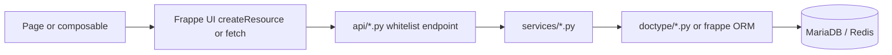
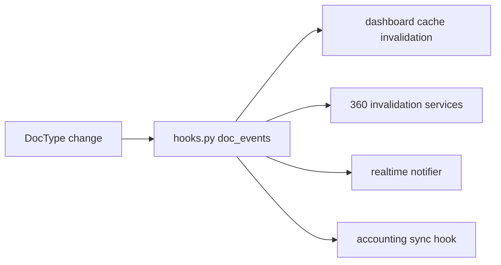
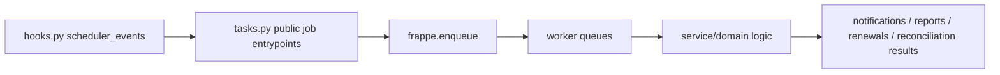

# Acentem Takipte Architecture Map

Last verified: 2026-05-05

This document is a repository-grounded architecture map for the current workspace. It is intended to replace approximate auto-generated summaries with a file-accurate view of how the application is structured and how its main runtime flows work.

For a shorter summary, use [ARCHITECTURE_OVERVIEW.md](ARCHITECTURE_OVERVIEW.md).

## 1. System Overview

`Acentem Takipte` is a hybrid Frappe + Vue application for insurance agency operations.

- Frappe provides the application container, DocTypes, permissions, scheduler jobs, background workers, site/session bootstrapping, and server-side APIs.
- Vue 3 provides the `/at` single-page workspace used for operational screens such as dashboard, customer, lead, policy, claims, payments, renewals, communication, reconciliation, and admin settings.
- MariaDB and Redis back the Frappe runtime.
- Built frontend assets are served by Frappe from the app's public asset surface.

## 2. Top-Level Repository Shape

### Runtime application

- `acentem_takipte/hooks.py`
  - Runtime Frappe hooks, route rules, document event wiring, scheduler definitions.
- `acentem_takipte/acentem_takipte/`
  - Main Python application package.
- `acentem_takipte/www/at.py` and `acentem_takipte/www/at.html`
  - Frappe entry point and HTML mount surface for the SPA.

### Frontend application

- `frontend/src/main.js`
  - Vue bootstrap, Frappe UI configuration, session hydration, realtime bootstrap.
- `frontend/src/App.vue`
  - Application shell, sidebar/topbar layout, route rendering, permission refresh notice.
- `frontend/src/router/index.js`
  - SPA route registry and navigation guards.
- `frontend/src/pages/`
  - Route-level screens.
- `frontend/src/components/`
  - Reusable UI components and screen-specific component groups.
- `frontend/src/composables/`
  - Screen runtime/composition logic.
- `frontend/src/stores/`
  - Pinia global state domains.
- `frontend/src/state/session.js`
  - Session bootstrap normalization and capability/realtime state.

### Supporting surfaces

- `docs/`
  - Project documentation and operational guides.
- `acentem_takipte/translations/`
  - Frappe translation CSV files.
- `tools/`
  - Repo utilities such as localization guard scripts.

## 3. Layered Architecture

## 3.1 Backend layers

### Frappe integration layer

Primary file: `acentem_takipte/hooks.py`

Responsibilities:

- declares `/at/<path:path> -> at` website routing
- configures `boot_session`
- wires document event handlers for core DocTypes
- schedules cron and daily jobs

### API layer

Primary directory: `acentem_takipte/acentem_takipte/api/`

Representative modules:

- `dashboard.py`
- `customers.py`
- `communication.py`
- `reports.py`
- `accounting.py`
- `admin_jobs.py`
- `admin_settings.py`
- `session.py`
- `quick_create.py`
- `list_exports.py`
- `security.py`

Responsibilities:

- exposes whitelisted Frappe methods for the SPA and desk-adjacent workflows
- validates request parameters and permission requirements
- coordinates domain service calls
- shapes payloads for workbenches, details, metrics, and exports

### Dashboard V2 slice

Primary directory: `acentem_takipte/acentem_takipte/api/v2/`

This is the current refactored dashboard slice. In this workspace it is named `api/v2`, not `api/dashboard_v2`.

Representative modules:

- `constants.py`
- `filters.py`
- `queries_customers.py`
- `queries_leads.py`
- `queries_kpis.py`
- `serializers.py`
- `tab_payload.py`
- `details_lead.py`
- `details_offer.py`
- `dashboard_security.py`

The orchestration entry point remains `api/dashboard.py`, which imports and composes these V2 modules.

### Service layer

Primary directory: `acentem_takipte/acentem_takipte/services/`

Responsibilities:

- implements reusable business logic outside the request layer
- centralizes domain workflows, 360 payload builders, report execution, scheduled-report fanout, privacy rules, branch normalization, and quick-create flows

Representative domains:

- `customer_360.py`, `lead_360.py`, `offer_360.py`, `policy_360.py`, `claim_360.py`, `payment_360.py`
- `branches.py`, `sales_entities.py`
- `renewals.py`, `payments.py`, `campaigns.py`, `customer_segments.py`
- `reporting.py`, `reports_runtime.py`, `report_exports.py`, `scheduled_reports.py`, `report_snapshots.py`
- `admin_general_settings.py`, `ops_alerts.py`, `ops_alert_settings.py`, `follow_up_sla.py`
- `privacy_masking.py`, `query_isolation.py`
- `quick_create/` and related `quick_create_*.py` modules

### Domain/document layer

Primary directory: `acentem_takipte/acentem_takipte/doctype/`

Responsibilities:

- defines core Frappe DocTypes and their validations/lifecycle behavior
- models the operational entities used by the SPA and jobs

Representative DocTypes:

- customer and ownership: `at_customer`, `at_customer_relation`, `at_ownership_assignment`
- sales pipeline: `at_lead`, `at_offer`
- insurance operations: `at_policy`, `at_policy_endorsement`, `at_policy_snapshot`, `at_claim`, `at_insured_asset`
- payments and reconciliation: `at_payment`, `at_payment_installment`, `at_accounting_entry`, `at_reconciliation_item`
- work management and communications: `at_task`, `at_reminder`, `at_activity`, `at_notification_draft`, `at_notification_outbox`, `at_notification_template`, `at_campaign`
- branch and access: `at_branch`, `at_office_branch`, `at_sales_entity`, `at_user_branch_access`, `at_user_sales_entity_access`
- control and audit: `at_break_glass_request`, `at_access_log`, `at_report_snapshot`, `at_emergency_access`

### Background job layer

Primary files:

- `acentem_takipte/hooks.py`
- `acentem_takipte/acentem_takipte/tasks.py`

Responsibilities:

- schedules recurring operational jobs
- enqueues async work into Frappe queues
- delegates heavy work to renewal, payments, communication, segmentation, reporting, and accounting services

## 3.2 Frontend layers

### App shell

Primary files:

- `frontend/src/main.js`
- `frontend/src/App.vue`
- `frontend/src/components/Sidebar.vue`
- `frontend/src/components/Topbar.vue`

Responsibilities:

- bootstraps Vue, Pinia, Vue Router, and Frappe UI
- hydrates session context from `window.AT_SESSION_BOOT`
- renders the shell layout and route outlet
- listens for access-scope refresh signals and realtime-related state

### Routing layer

Primary file: `frontend/src/router/index.js`

Responsibilities:

- maps `/at` routes to pages
- groups screens by business surface
- applies route metadata and access checks
- keeps office branch query context consistent

Route groups include:

- dashboard
- leads, offers, customers, policies
- claims, payments, renewals
- communication
- reconciliation and reports
- admin settings
- auxiliary workbench and record detail screens
- break-glass request and approvals

### Page layer

Primary directory: `frontend/src/pages/`

Responsibilities:

- route-level user experiences
- orchestrates data loading, actions, and screen-specific components

Examples:

- `Dashboard.vue`
- `CustomerList.vue`, `CustomerDetail.vue`
- `LeadList.vue`, `LeadDetail.vue`
- `PolicyList.vue`, `PolicyDetail.vue`
- `ClaimsBoard.vue`, `ClaimDetail.vue`
- `PaymentsBoard.vue`, `PaymentDetail.vue`
- `RenewalsBoard.vue`, `RenewalTaskDetail.vue`
- `Reports.vue`
- `AdminGeneralSettings.vue`
- `AdminAlertChannelsSettings.vue`

### Composable/runtime layer

Primary directory: `frontend/src/composables/`

Responsibilities:

- extracts screen logic from pages
- normalizes API payloads into UI-ready data
- owns local edit/runtime behavior

Examples:

- customer list/detail runtime composition
- dashboard tab helpers
- policy and detail runtime mappers
- sidebar navigation helpers

### State layer

Primary directories/files:

- `frontend/src/stores/`
- `frontend/src/state/session.js`

Responsibilities:

- tracks authenticated user context, branch scope, capabilities, realtime config, filters, and domain-specific list/detail state

Main stores:

- `auth.js`
- `branch.js`
- `dashboard.js`
- `customer.js`
- `policy.js`
- `payment.js`
- `claim.js`
- `communication.js`
- `renewal.js`
- `ui.js`

## 4. Core Runtime Flows

## 4.1 SPA bootstrap flow

```mermaid
flowchart LR
  A[Browser requests /at/...]
  B[acentem_takipte/hooks.py website_route_rules]
  C[acentem_takipte/www/at.html]
  D[window.AT_SESSION_BOOT]
  E[frontend/src/main.js]
  F[frontend/src/state/session.js]
  G[frontend/src/App.vue]
  H[frontend/src/router/index.js]
  I[frontend/src/pages/*]

  A --> B --> C --> D --> E --> F --> G --> H --> I
```

Detailed steps:

1. Frappe routes `/at/<path:path>` to the `at` website endpoint.
2. `at.html` renders the mount node and injects `window.AT_SESSION_BOOT`.
3. `main.js` creates the Vue app and configures Frappe UI and CSRF handling.
4. `state/session.js` normalizes the boot payload into reactive session state.
5. `App.vue` renders the shell and `RouterView`.
6. The router selects a page component for the requested route.

## 4.2 SPA request flow

Typical examples:

- dashboard pages call `api/dashboard.py`, which composes `api/v2/*`
- detail screens call domain APIs and receive service-built payloads
- inline edits call mutation endpoints and persist through Frappe ORM / `frappe.client.set_value`

## 4.3 Document mutation and cache invalidation flow

Important characteristics:

- core business documents trigger broad invalidation fanout
- policy and claim changes can also trigger accounting sync
- lightweight collaboration records such as tasks/reminders/activity emit realtime-only updates

## 4.4 Scheduler and worker flow

Verified recurring jobs:

- every 10 minutes: notification queue processing
- hourly: accounting sync, break-glass grant expiry, ops alert monitor
- daily windows: renewal task creation, renewal reminders, stale renewal cleanup, payment due jobs, campaigns, customer segment snapshots, scheduled reports, reconciliation

## 5. Business Domain Map

### Customer and sales portfolio

- customer search, customer list, customer detail
- lead list/detail and offer board/detail
- branch-aware ownership and representative assignment

Primary backend surfaces:

- `doctype/at_customer*`
- `api/customers.py`
- `services/customer_360.py`, `lead_360.py`, `offer_360.py`
- `api/dashboard.py` and `api/v2/queries_customers.py`, `queries_leads.py`

### Insurance operations

- policies, endorsements, claims, insured assets, renewals

Primary backend surfaces:

- `doctype/at_policy*`, `at_claim`, `at_renewal_*`
- `renewal/`
- `services/policy_360.py`, `claim_360.py`, `renewals.py`

### Payments, accounting, and reconciliation

- payment workbench/detail
- accounting sync jobs
- reconciliation workbench/detail

Primary backend surfaces:

- `accounting.py`
- `api/accounting.py`
- `services/accounting_runtime.py`
- `doctype/at_payment*`, `at_accounting_entry`, `at_reconciliation_item`

### Communication and outbound operations

- notification drafts
- outbox processing
- campaigns and alert channels

Primary backend surfaces:

- `communication.py`
- `notification_dispatch.py`
- `notification_seed_service.py`
- `api/communication.py`
- `services/notifications.py`, `campaigns.py`, `ops_alerts.py`, `ops_alert_settings.py`

### Reporting and admin control

- reports UI
- premium, claim ratio, agent performance, customer segmentation reports
- scheduled reports and snapshots
- admin general settings and alert channel settings

Primary backend surfaces:

- `api/reports.py`
- `services/reporting.py`, `reports_runtime.py`, `scheduled_reports.py`, `report_snapshots.py`
- `api/admin_settings.py`
- `services/admin_general_settings.py`

### Break-glass and access control

- emergency access request/approval workflow
- branch and sales-entity access
- session-scoped capabilities surfaced to the SPA

Primary backend surfaces:

- `api/break_glass.py`
- `services/break_glass.py`
- `doctype/at_break_glass_request`, `at_user_branch_access`, `at_user_sales_entity_access`
- `api/security.py`, `api/session.py`

## 6. Cross-Cutting Concerns

### Permission and scope model

- Frappe roles govern coarse access.
- Branch and sales-entity assignments refine visible data.
- Session bootstrap exposes `capabilities`, `office_branches`, `default_office_branch`, and `can_access_all_office_branches` to the SPA.
- Router and UI logic consume those session signals for navigation and action gating.

### Realtime model

- Session bootstrap includes a `realtime` config.
- `main.js` and `state/session.js` normalize whether realtime is enabled.
- `realtime.py` is wired through doc events for change notifications.

### Cache invalidation

- `api/dashboard_cache.invalidate_dashboard_cache` is part of the doc event fanout.
- `*_360.invalidate_*_from_doc_event` services refresh detail payload surfaces.

### Localization

- Frappe translations live under `acentem_takipte/translations/`.
- Frontend locale is normalized in `state/session.js` and reflected into `document.documentElement.lang`.

### Build and deployment boundary

- Vue source is authored in `frontend/`.
- built assets are emitted for Frappe consumption and are not intended to be committed as source artifacts.

## 7. What Is Not Part of This Verified Map

The current workspace does not show a `.agents/skills/` tree. If external summaries mention a large in-repo AI skill framework, treat that as outside the scope of this verified workspace snapshot unless those files are later restored or checked out.

Likewise, use the actual `docs/` directory in this workspace as the source of truth for project documentation. Auto-generated summaries may refer to docs paths that do not exist here.

## 8. Fast Navigation Index

Use these files as the quickest entry points when orienting in the codebase:

- runtime hooks: `acentem_takipte/hooks.py`
- SPA HTML mount: `acentem_takipte/www/at.html`
- SPA bootstrap: `frontend/src/main.js`
- shell and layout: `frontend/src/App.vue`
- router: `frontend/src/router/index.js`
- session state: `frontend/src/state/session.js`
- dashboard orchestration: `acentem_takipte/acentem_takipte/api/dashboard.py`
- dashboard refactor modules: `acentem_takipte/acentem_takipte/api/v2/`
- service layer root: `acentem_takipte/acentem_takipte/services/`
- DocType root: `acentem_takipte/acentem_takipte/doctype/`
- jobs: `acentem_takipte/acentem_takipte/tasks.py`

## 9. Practical Reading Order

For a new contributor, the most efficient reading order is:

1. `README.md`
2. `AGENTS.md`
3. `acentem_takipte/hooks.py`
4. `acentem_takipte/www/at.html`
5. `frontend/src/main.js`
6. `frontend/src/App.vue`
7. `frontend/src/router/index.js`
8. the relevant page under `frontend/src/pages/`
9. the matching composable/store
10. the matching `api/*.py` entrypoint and then `services/*.py`

That path moves from framework entry to UI surface to domain logic with minimal context switching.