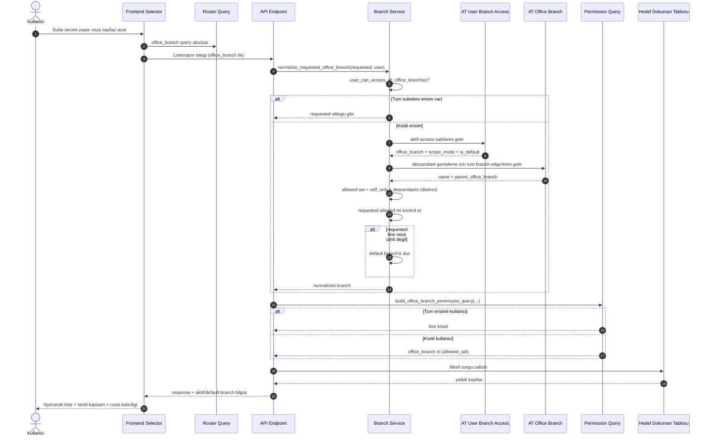

# Acente Erisim ve Organizasyon Modeli

## 1) Amac
Bu dokuman, asagidaki 4 yapiyi birlikte ele alarak tutarli bir erisim ve organizasyon modeli tanimlar:
- AT Office Branch
- AT User Branch Access
- AT Sales Entity
- User

Hedefler:
- Tek bir merkez sube (head office) kurali
- Alt sube hiyerarsisi (tree)
- Kullanici erisiminin hiyerarsik olarak dogru genislemesi
- Satis birimi sahipligi ile sube yapisinin uyumlu olmasi

## 2) Kavramsal Model

### 2.1 AT Office Branch (organizasyon agaci)
- Organizasyon agacinin kaynagi.
- Alanlar:
  - office_branch_name
  - office_branch_code
  - parent_office_branch
  - is_active
  - is_head_office (yeni)
- Is kurallari:
  - Sadece 1 adet merkez sube olabilir.
  - Merkez subenin parent_office_branch alani bos olmalidir.
  - Merkez disi subeler parent_office_branch ile agaca baglanmalidir.
  - Self-parent ve dongu (A->B->C->A) yasaklanir.

### 2.2 AT User Branch Access (erisim politikasi)
- Kullaniciya verilen sube erisim haklarini tutar.
- Alanlar:
  - user
  - office_branch
  - is_default
  - is_active
  - scope_mode (yeni: self_only | self_and_descendants)
- Is kurallari:
  - Kullanici basina tek default sube.
  - is_active=1 olmayan satirlar erisim hesabina katilmaz.
  - scope_mode=self_and_descendants ise alt dugumlere erisim otomatik genisler.

### 2.3 AT Sales Entity (satis orgutu)
- Satis sahipligi hiyerarsisini temsil eder.
- Alanlar:
  - entity_type
  - full_name
  - parent_entity
  - office_branch (yeni, zorunlu)
- Is kurallari:
  - Her sales entity bir office branch ile iliskili olmalidir.
  - parent_entity kullaniliyorsa ayni office branch icinde kalmasi tercih edilir.

### 2.4 User
- Operasyonel profil ve rol kimligi.
- Erisim kaynagi olarak dogrudan User yerine AT User Branch Access baz alinmalidir.

## 3) Erişim Mantigi

### 3.1 Yetki hesaplama
1. Kullanicinin aktif AT User Branch Access satirlari alinir.
2. Her satir icin:
   - self_only: sadece office_branch
   - self_and_descendants: office_branch + tum alt subeler
3. Tum set birlestirilir (distinct).
4. Permission query bu set uzerinden IN kosulu uretir.

### 3.2 Varsayilan sube secimi
- Kullanici basina tek default sube AT User Branch Access uzerinden gelir.
- Tum subelere erisebilen rolde (System Manager/Administrator) default zorlamasi yapilmaz.

## 4) Frappe Tree Gosterimi
- `/app/at-office-branch` ekrani tree olarak kullanilir.
- Merkez sube root node olur.
- Alt subeler parent-child olarak gorunur.
- Liste sirasi yerine agac yapisi esas alinacaktir.

## 5) Uygulama Plani (P0/P1/P2)

### P0 - Veri Butunlugu ve Asgari Calisan Model
- [x] AT Office Branch doctype: is_head_office alani ekle.
- [x] AT Office Branch validate:
  - [x] tek merkez
  - [x] merkezde parent yok
  - [x] merkez disinda parent zorunlu (opsiyon: ilk geciste warning, sonra zorunlu)
  - [x] cycle kontrolu
- [x] AT User Branch Access doctype: scope_mode alani ekle.
- [x] services/branches.py:
  - [x] subtree cozumleyici yardimci fonksiyonlar
  - [x] allowed branch setini scope_mode ile uret
- [x] branch_permissions.py:
  - [x] yeni allowed seti kullanmaya devam edecek sekilde doğrulama
- [x] Migration patch:
  - [x] merkez sube belirle (oncelik: AT Sigorta)
  - [x] diger subeleri merkeze bagla (parent_office_branch)
  - [x] default branch tekilligi duzelt

Cikis kriteri (P0):
- Tree hiyerarsisi veri bazinda tutarli.
- Permission hesaplama alt subeleri dogru kapsiyor.
- Mevcut ekranlar bozulmadan calisiyor.

### P1 - Satis Birimi Entegrasyonu
- [x] AT Sales Entity doctype: office_branch alani ekle (zorunlu).
- [x] AT Sales Entity validate:
  - [x] parent_entity varsa office_branch uyumu kurali
- [x] quick_create / update akislari:
  - [x] office_branch alanini kabul et ve dogrula
- [x] Migration patch:
  - [x] sales entity records icin office_branch backfill

Cikis kriteri (P1):
- Her sales entity bir subeye bagli.
- Satis sahipligi raporlari office_branch bazinda ayrisabiliyor.

### P2 - UI/UX ve Operasyonel Iyilestirmeler
- [x] Office branch selector:
  - [x] agac gorunumlu secim (girinti/etiket)
  - [x] merkez + altlarin anlasilir listesi
- [x] `/app/at-office-branch` tree deneyimi:
  - [x] merkez rozet/etiket
  - [x] drag/drop veya parent degisimi kontrollu
- [x] Testler:
  - [x] model validation testleri
  - [x] permission kapsam testleri
  - [x] route ve secim kaliciligi testleri

Cikis kriteri (P2):
- Kullanici tarafinda sube secimi ve hiyerarsi davranisi net, tutarli ve ongorulebilir.

## 6) Kodlama Sirasi (onerilen)
1. P0 schema + validate + patch
2. P0 permission servisleri
3. P0 smoke/regression test
4. P1 sales entity baglantisi ve patch
5. P2 selector/tree UX

## 7) Riskler ve Onlemler
- Risk: Eski datada parent bilgisi eksik olabilir.
  - Onlem: patch ile otomatik merkez baglama.
- Risk: Erişim ani daralabilir.
  - Onlem: once dry-run SQL kontrol, sonra patch.
- Risk: Selector davranisi degisince kullanici aliskanligi etkilenebilir.
  - Onlem: rollout notu + kisa kullanim rehberi.

## 8) Kabul Kriterleri (Nihai)
- Tek merkez sube garanti altinda.
- Alt subeler tree yapisinda dogru bagli.
- User branch access kapsam mantigi deterministic.
- Sales entity mutlaka bir office branch ile iliskili.
- Sayfalar arasi gezerken secili sube beklenmedik sekilde degismiyor.

## 9) Hiyerarsi Mantigi (Tekrar ve Net Akis)

Bu bolum, tum hiyerarsinin runtime davranisini tek bir karar akisi olarak ozetler.

### 9.1 Organizasyon (AT Office Branch) - dogruluk kurallari
1. Merkez sube tekildir (`is_head_office=1` yalnizca bir kayitta olabilir).
2. Merkez subenin parent'i bos olmak zorundadir.
3. Merkez disindaki subeler, sistemde merkez varsa parent ile agaca baglanmak zorundadir.
4. Self-parent ve cycle (A->B->C->A) engellenir.

Sonuc: Veri katmaninda her sube agac icinde tek bir konuma sahiptir.

### 9.2 Kullanici kapsami (AT User Branch Access) - yetki genisleme
Her aktif access satiri icin kural:
- `self_only`: yalnizca satirdaki sube
- `self_and_descendants`: satirdaki sube + tum alt subeler (BFS ile cocuklardan torunlara genisler)

Bir kullanicinin tum aktif satirlari birlestirilir ve `distinct` edilerek izinli sube kumesi elde edilir.

Admin istisnasi:
- `Administrator` veya `System Manager` rollerinde kullanici tum subelere erisir.

### 9.3 Varsayilan / istenen sube normalizasyonu
`normalize_requested_office_branch(requested, user)` davranisi:
1. Kullanici tum subelere erisebiliyorsa `requested` oldugu gibi kabul edilir.
2. Kullanici kisitliysa:
  - Izinli sube yoksa `None`
  - `requested` bossa kullanicinin default subesi
  - `requested` izinli listede varsa `requested`
  - `requested` izinli degilse default sube

`assert_office_branch_access` ise kullanicinin acikca izinli olmayan bir sube istemesi durumunda hata firlatir.

### 9.4 Permission query'ye donusum
Kisitli kullanicilar icin:
- `office_branch in (izinli_subeler)`
- Izinli sube yoksa `1=0`

Tum erisimli kullanici icin query kosulu bos doner (ek kisit uygulanmaz).

### 9.5 Frontend secim davranisi (selector + route)
1. Session'dan subeler ve `canAccessAllOfficeBranches` hydrate edilir.
2. Baslangic secimi:
  - Session default varsa o
  - Yoksa `is_default=1`
  - O da yoksa ilk kayit
3. Route query (`office_branch`) gecerliyse secim route'tan sync edilir.
4. Kullanici secim yaptiginda query persist edilir.
5. Tum sube erisimi olan kullanici secimi temizlerse (`null`) kapsam "Tüm Şubeler" olur.

### 9.6 UX semantigi (karisiklik olmasin)
- `Merkez sube`: Organizasyon root'u (`is_head_office=1`).
- `Varsayilan sube`: Kullaniciya atanmis default access satiri (`is_default=1`).

Bu iki kavram ayni olabilir ama olmak zorunda degildir.

### 9.7 Ornek senaryolar
Senaryo A - Kisitli acente kullanicisi:
- Access: `HQ (self_and_descendants)`, default `HQ`
- Agac: `HQ -> ANK, IZM`
- Etkin kapsama cikan set: `{HQ, ANK, IZM}`

Senaryo B - Kisitli kullanici, tek sube:
- Access: `ANK (self_only)`, default `ANK`
- Etkin kapsama cikan set: `{ANK}`
- UI selector kilitli kapsam gibi davranir.

Senaryo C - Admin:
- Tanimli access satiri olmasa bile tum aktif subelere erisim vardir.
- Route query'de gelen sube dogrudan kabul edilir.

## 10) Sequence Diyagrami (Request -> Normalize -> Permission -> UI)



Not:
- `Merkez sube` org root kavramidir, `Varsayilan sube` kullanici tercihidir.
- Bu iki deger farkli oldugunda da akis dogru calisir.

## 11) Rol ve Erisim Karar Tablosu

Bu bolum, mevcut durumu ve hedef modeli ayni tabloda netlestirir.

### 11.1 Mevcut durum kontrolu (yapilanlar)

| Alan | Hedef | Mevcut Durum | Sonuc |
|---|---|---|---|
| AT Office Branch | Tek merkez + parent/cycle kurallari | Validate ile tek merkez, parent zorunlulugu, cycle engeli calisiyor | Tamam |
| AT User Branch Access | `scope_mode` + tek default + aktif satir | `self_only/self_and_descendants`, tek default kurali var | Tamam |
| Branch kapsam hesaplama | Alt sube genisleme + normalize | Branch service icinde descendant genisleme ve default fallback var | Tamam |
| Permission hook'lari | Lead/Offer/Policy/... icin branch filtre | Hook ve permission query ile branch bazli filtreleme var | Tamam |
| AT Sales Entity | `office_branch` zorunlu + parent uyumu | Parent sales entity ile ayni branch zorlamasi var | Tamam |
| Is ortagi user izolasyonu | Sadece kendi kayitlarini gorme | Sistem genelinde zorunlu sales_entity bazli erisim katmani yok | Eksik |

### 11.2 Hedef erisim modeli (istenen)

| Rol | Branch Scope | Sales Entity Scope | Gormesi Gereken |
|---|---|---|---|
| System Manager / Administrator | Tum subeler | Tum sales entity'ler | Tum kayitlar |
| Manager (ic ekip) | AT User Branch Access | Opsiyonel | Yetkili branchlerde tum operasyon |
| Agent (ic ekip) | AT User Branch Access | Opsiyonel + atama odakli | Branch + atama kapsamindaki kayitlar |
| Partner (is ortagi) | AT User Branch Access | Zorunlu (kendi entity) | Yalnizca kendi sales_entity kayitlari |

### 11.3 Doctype bazli nihai filtre formulu

| Doctype | Mevcut | Nihai Oneri |
|---|---|---|
| AT Lead | Branch filtresi | `branch AND sales_entity` |
| AT Offer | Branch filtresi | `branch AND sales_entity` |
| AT Policy | Branch filtresi | `branch AND sales_entity` |
| AT Claim | Branch filtresi | `branch AND sales_entity` |
| AT Payment | Branch filtresi | `branch AND sales_entity` |
| AT Customer | Agent icin `assigned_agent + branch` | Mevcut korunur, Partner icin sales_entity iliskisi eklenir |

Not: Partner rolunde `sales_entity` filtresi zorunlu olmalidir. Ic ekip rollerinde politika geregi opsiyonel kalabilir.

## 12) P3 Yol Haritasi (Sales Entity bazli izolasyon)

### P3.1 Modelleme
- Yeni doctype: `AT User Sales Entity Access`
- Alanlar: `user`, `sales_entity`, `scope_mode`, `is_default`, `is_active`
- `scope_mode`: `self_only | self_and_descendants`

### P3.2 Servis katmani
- Yeni servis: allowed sales entity seti hesaplama
- Kural: aktif satirlar birlesir, descendant mode ile hiyerarsi genisler, sonuc distinct edilir

### P3.3 Permission entegrasyonu
- Branch filtresi ile sales entity filtresi birlestirilir:
  - `final_filter = branch_filter AND sales_entity_filter`
- Partner rolu icin sales entity filtresi bos ise sonuc `1=0`

### P3.4 Gecis ve veri duzenleme
- Migration patch:
  - Mevcut kullanicilar icin baslangic sales entity erisim satiri olusturma/backfill
  - Coklu default durumlarini tekillestirme

### P3.5 Test kapsami
- Unit:
  - Sales entity descendant kapsam testleri
  - Branch + sales_entity birlesik filtre testleri
- Integration:
  - Partner kullanici kendi disindaki entity kayitlarini gormemeli
  - Manager kullanici policy'ye uygun genis kapsami gorebilmeli

### P3 cikis kriteri
- Is ortagi user, sisteme girdiginde yalnizca kendi sales_entity verilerini gorur.
- Ic ekip branch bazli operasyonu bozulmadan devam eder.
- Branch ve sales entity filtreleri deterministic ve testlerle garanti altindadir.

## 13) Operasyonel Kor Nokta Kapatma Plani

Bu bolum, sigorta acentesi operasyonlarinda gorulen kritik senaryolari modele ekler.

### 13.1 Musteri sahipligi ve paylasim (data silo engeli)
- Ilke: `AT Customer` kaydi tekil kimliktir (TC/VKN bazli duplicate engeli) ve global aranabilir olmalidir.
- Yetki ayrimi:
  - Musteri kartinin temel varlik bilgisi (ad, masked kimlik, var/yok bilgisi) kontrollu sekilde gorulebilir.
  - Hassas islem verileri (teklif, police, hasar, odeme) `branch + sales_entity` filtresi ile korunur.
- Yeni surec:
  - Yetkisiz kullanici musteri buldugunda "Kayit mevcut" bilgisi alir.
  - Detay acma yerine "Erisim Talep Et" / "Transfer Talep Et" akisi tetiklenir.

### 13.2 Gecmis veri ve transfer (historical snapshot)
- Problem: Sales Entity sube degistirdiginde eski kayit gorunurlugu bozulmamali.
- Cozum:
  - Islemsel dokumanlarda iki alan ayrimi:
    - `origin_office_branch` (kayit anindaki snapshot, degismez)
    - `current_office_branch` (guncel operasyon sorumlulugu, degisebilir)
  - Yetki kontrolunde ana referans `origin_office_branch` olur.
  - Operasyonel sahiplik (is listesi, takip) icin `current_office_branch` kullanilabilir.

### 13.3 Performans ve cache stratejisi
- Login aninda veya kapsam degisiminde precompute:
  - `allowed_branches`
  - `allowed_sales_entities`
- Bu setler `frappe.session` / Redis cache katmaninda tutulur.
- Permission query runtime'da agac taramak yerine hazir seti kullanir.
- Cache invalidation tetikleyicileri:
  - User Branch/Sales Entity access degisimi
  - Office Branch / Sales Entity hiyerarsi degisimi
  - Rol degisimi

### 13.4 Shadowing (gecici vekalet/izleme)
- `AT User Branch Access` (ve P3'te `AT User Sales Entity Access`) icin:
  - `valid_until` alani eklenir.
  - Sureli yetkiler tarih bitiminde otomatik pasif kabul edilir.
- Boylesiyle kalici yetki ile gecici gorevlendirme ayrilir.

### 13.5 Raporlama ve dashboard izolasyonu
- Uyari: Frappe standart permission query list view'i kapsar; custom SQL/report kodunda manuel entegrasyon gerekir.
- Kural:
  - Tum Script Report / API dashboard sorgulari `allowed_branches` ve `allowed_sales_entities` servisi ile filtrelenir.
  - Filtre uygulanmayan sorgu release'e cikamaz (checklist gate).

## 14) Guncellenmis Senaryo Karar Tablosu

| Senaryo | Beklenen Davranis | Model Karsiligi |
|---|---|---|
| Danisman isten ayrildi | Kayitlar sahipsiz kalmamali | Sales Entity pasif + parent/admin fallback ownership |
| Capraz satis (cross-sell) | Farkli subeden musteriye police kesilebilmeli | Musteri global bulunur, yeni islem kaydi yeni branch/sales_entity ile acilir |
| Zeyilname islemi | Eski police zinciri gorulebilmeli | Policy chain ve origin snapshot branch uzerinden kontrollu erisim |
| Temsilci transferi | Eski kayitlar kaybolmamali | `origin_office_branch` sabit, `current_office_branch` guncellenebilir |
| Gecici denetim/vekalet | Sureli ek gorunum verilebilmeli | `valid_until` ile shadowing yetkisi |

## 15) P3 Guncel Uygulama Sirasi (Revize)

1. Model: `AT User Sales Entity Access` + `valid_until` alanlari
2. Servis: branch/entity allowed set precompute + cache
3. Permission: `branch AND sales_entity` zorunlu birlesik filtre
4. Historical: `origin_office_branch` / `current_office_branch` alanlari
5. Report hardening: tum custom report/dashboard sorgularinin zorunlu filtrelenmesi
6. Migration: duplicate/default/transfer verilerinin guvenli backfill'i
7. Test: unit + integration + report-security regression testleri

### Revize cikis kriteri
- Is ortagi user yalnizca kendi sales entity kapsaminda kayit gorur.
- Musteri duplicate olusmadan branchler arasi operasyon yapilabilir.
- Transfer/vekalet senaryolari veri kaybi ve yetki sizintisi olmadan yonetilir.
- Dashboard ve raporlar list view ile ayni izolasyon seviyesini korur.

## 16) Frappe Erisim Kontrol Matrisi (Somut Uygulama)

Bu bolum, yazilim ekibinin dogrudan uygulayabilecegi fonksiyonel matrisi ve teknik notlari toplar.

### 16.1 Functional Matrix

| Doctype | Admin / System Manager | Ic Ekip - Manager | Ic Ekip - Agent | Is Ortagi / Partner Agent |
|---|---|---|---|---|
| AT Office Branch | Full (Tree View) | Yetkili branch + altlari | Sadece kendi branch'i | Sadece kendi branch'i |
| AT Sales Entity | Full list | Yetkili branchlerde tum yapi | Sadece kendi kaydi | Kendisi + alt ekibi (descendants) |
| AT Customer | Sinirsiz | Yetkili branchlerde tum musteriler | Yetkili branch + atanmislar | Global search, detay yetkiye tabi |
| AT Lead / AT Offer | Sinirsiz | Yetkili branchlerde tum kayitlar | Kendi branch havuzu | Sadece kendi sales entity kayitlari |
| AT Policy | Sinirsiz | Yetkili branchlerde tum policeler | Kendi kestikleri + yetkili kapsam | Sadece kendi portfoyu |
| Reports / Dashboard | Tum sirket konsolide | Branch bazli kumulatif | Kisisel hedef/gerceklesen | Sadece kendi hak edis/uretim |

### 16.2 Merkezi filtre kurali

- Temel kural: final filtre branch ve sales entity kesisimidir.
- Formul:
  - branch_filter
  - partner veya kisitli rolde ek sales_entity_filter
  - final_filter = branch_filter AND sales_entity_filter
- Admin/System Manager icin filtre bos olabilir.

### 16.3 Global Customer Search (duplicate engelleme)

Partner kullanicida musteri kaydi yonetimi iki asamali olmalidir:

1. Liste yetkisi:
  - Partner icin standart AT Customer listesi bos gelir (varsayilan liste query kisitli).
2. Kimlik bazli sorgu (TC/VKN):
  - Kayit yoksa: yeni kayit olusturma akisi
  - Kayit var ama yetki yoksa: "Kayit mevcut, transfer/paylasim talebi olusturun" mesaji
  - Kayit var ve yetki varsa: kart acilir

Not: Bu yaklasim hem duplicate riskini dusurur hem de musteri sahipligini korur.

### 16.4 Kritik checklist (gelistirme oncesi zorunlu)

- Zeyilname zinciri:
  - Endorsement kayitlari ana policenin yetki zinciriyle uyumlu olmalidir.
- Default branch otomasyonu:
  - Yeni Lead/Customer olusurken office_branch default degerle otomatik dolmalidir.
  - Kullanici yetkisi disindaki branch secememelidir.
- Audit log:
  - Manager alt branch verisine eristiginde
  - Kayit branch/entity transferi oldugunda
  - sistemde iz birakilmalidir (comment/log/event).

### 16.5 Performans ve indeksleme

- Buyuk veri setlerinde IN tabanli filtrelerin maliyeti artar.
- Zorunlu indeksler:
  - islemsel tablolarda office_branch index
  - islemsel tablolarda sales_entity index
- Cache stratejisi:
  - allowed_branches ve allowed_sales_entities login/scope degisiminde precompute edilir.
  - permission query hazir setleri kullanir.

### 16.6 Development checklist (ekip icin)

1. Role policy netligi:
  - Partner rolu acik tanimlanmis mi?
2. Permission hook kapsami:
  - Tum hedef doctype'larda branch + sales_entity filtreleri uygulanmis mi?
3. Report hardening:
  - Script report ve dashboard SQL'leri ayni kurali kullaniyor mu?
4. Migration guvenligi:
  - Backfill, default tekilligi ve transfer senaryolari test edildi mi?
5. Regression test:
  - Role bazli gorunurluk testleri yesil mi?

## 17) Site Geneli Kapsam Haritasi (Tum Doctypelar)

Bu bolum, "tum doctypelara ayni filtre mi?" sorusunu siniflandirilmis bir yaklasimla netlestirir.

### 17.1 Ana ilke
- Evet, tum site kapsam modeline dahil olmalidir.
- Hayir, tum doctypelara birebir ayni permission query uygulanmamalidir.
- Dogru yaklasim: doctypelari veri hassasiyetine ve iliski tipine gore 4 sinifa ayirmak.

### 17.2 Doctype siniflari

| Sinif | Tanim | Filtre Stratejisi |
|---|---|---|
| A - Dogrudan hassas islemsel | office_branch/sales_entity dogrudan alani olan kayitlar | `branch AND sales_entity` zorunlu |
| B - Dolayli hassas iliskili | Parent/foreign kayit uzerinden hassas kayda bagli | Join/subquery ile parent kapsam filtresi |
| C - Global master / referans | Ortak katalog veya paylasimli arama verisi | Liste sinirli, detay/islem policy ile |
| D - Sistem/Frappe cekirdek | User, Role, DocType, Log, Version vb. | Branch/sales_entity degil, rol bazli admin policy |

### 17.3 Bu projede ornek siniflandirma

| Sinif | Ornek Doctypelar |
|---|---|
| A | AT Lead, AT Offer, AT Policy, AT Claim, AT Payment, AT Renewal Task, AT Notification Draft, AT Notification Outbox, AT Accounting Entry |
| B | AT Reconciliation Item (AT Accounting Entry uzerinden), endorsement/policy chain bagli kayitlar |
| C | AT Customer (global arama + kontrollu detay), AT Insurance Company, AT Branch master |
| D | User, Role, Has Role, DocType, Version, Error Log (ve benzeri framework nesneleri) |

### 17.4 Uygulama kurali (release gate)

Her yeni doctype veya rapor icin release oncesi su kararlar zorunlu olmalidir:

1. Bu doctype hangi sinifa giriyor (A/B/C/D)?
2. Filtre fonksiyonu nerede uygulanacak?
  - permission_query_conditions
  - has_permission
  - custom SQL/report katmani
3. Branch ve sales_entity alanlari indexli mi?
4. Test kapsami var mi?
  - role bazli gorunurluk
  - yetki disi kayit erisimi
  - performans/regression

### 17.5 Hedef sonuc

- Tum site tek bir kapsam politikasina bagli calisir.
- Sadece islemsel dogaya uygun dogru filtre tipi uygulanir.
- Veri sizintisi, duplicate ve performans riski birlikte kontrol altina alinir.

## 18) Doctype Hook Envanteri ve Aksiyon Listesi

Bu bolum, mevcut hook kapsamini ve "hemen/sonra" aksiyonlarini somutlastirir.

### 18.1 Mevcut durumda hook ile kapsananlar (A sinifi cekirdek)

| Doctype | permission_query_conditions | has_permission | Durum |
|---|---|---|---|
| AT Customer | Var | Var | Aktif |
| AT Lead | Var | Var | Aktif |
| AT Offer | Var | Var | Aktif |
| AT Policy | Var | Var | Aktif |
| AT Payment | Var | Var | Aktif |
| AT Claim | Var | Var | Aktif |
| AT Renewal Task | Var | Var | Aktif |
| AT Accounting Entry | Var | Var | Aktif |
| AT Reconciliation Item | Var | Var | Aktif (dolayli) |
| AT Notification Draft | Var | Var | Aktif |
| AT Notification Outbox | Var | Var | Aktif |

### 18.2 A/B sinifinda olup kapsam genisletilecekler

| Doctype | Mevcut Alan Sinyali | Beklenen Aksiyon | Oncelik |
|---|---|---|---|
| AT Activity | office_branch + source/assigned_to | Branch + (gerekirse parent kaynak) filtre hook'u ekle | Yuksek |
| AT Task | office_branch + source/assigned_to | Branch + kaynak dokuman zinciriyle filtre | Yuksek |
| AT Reminder | office_branch + source/assigned_to | Branch + kaynak dokuman zinciriyle filtre | Yuksek |
| AT Ownership Assignment | office_branch + source/assigned_to | Branch + assigned_to/sales_entity policy netlestir | Yuksek |
| AT Call Note | office_branch | Branch filtre hook'u ekle | Orta |
| AT Campaign | office_branch | Branch filtre hook'u ekle | Orta |
| AT Payment Installment | office_branch | Parent payment/policy ile dolayli filtre | Orta |
| AT Renewal Outcome | office_branch | Parent renewal task ile dolayli filtre | Orta |
| AT Policy Snapshot | source_doctype/source_name | Parent policy ile dolayli filtre | Orta |
| AT Policy Endorsement | policy zinciri | Ana policy yetki zincirine bagla | Yuksek |

### 18.3 C sinifi (global/referans) policy netlestirme listesi

| Doctype | Onerilen Policy |
|---|---|
| AT Customer | Global search + kontrollu detay/islem |
| AT Insurance Company | Referans master (rol bazli read) |
| AT Branch | Referans master (rol bazli read) |
| AT Sales Entity | Rol + branch/sales_entity hiyerarsisine gore kontrollu read |

### 18.4 D sinifi (sistem) - kapsam disi notu

Asagidaki tipler branch/sales_entity filtre yerine rol tabanli admin policy ile yonetilir:
- User
- Role / Has Role
- DocType
- Version / Error Log ve benzeri framework kayitlari

### 18.5 Uygulama backlog'u (kisa)

1. [x] Tamamlandi - Yuksek oncelikli doctype'larda hook ekleme: Activity, Task, Reminder, Ownership Assignment, Policy Endorsement
2. [ ] Tamamlanmadi - Dolayli filtre katmani: source_doctype/source_name uzerinden parent zincir filtresi
3. [x] Tamamlandi - C sinifi policy endpoint'leri: global search + transfer/paylasim akisi
4. [ ] Tamamlanmadi - Test paketi: doctype bazli gorunurluk + yetki disi erisim + regression
5. [ ] Tamamlanmadi - Rapor hardening: script report/dashboard sorgulari icin ayni kapsam servislerini zorunlu kullanma

## 19) P3 Sprint Gorev Listesi (Dosya Bazli)

Bu bolum, dogrudan implementasyona gecmek icin dosya bazli gorevleri listeler.

### 19.1 Sprint A - Altyapi ve model (Yuksek oncelik)

| Gorev | Dosya/Modul | Cikti | Durum |
|---|---|---|---|
| User-SalesEntity erisim modeli ekle | `doctype/at_user_sales_entity_access/*` (yeni) | Doctype + validate + tek default + scope_mode | [x] Tamamlandi |
| Erisim servisi | `services/sales_entities.py` (yeni) | allowed_sales_entities + descendant genisleme | [x] Tamamlandi |
| Branch + entity birlesik filtre yardimcisi | `doctype/branch_permissions.py` | ortak helper: final_filter olusturma | [x] Tamamlandi |
| Shadowing suresi | `doctype/at_user_branch_access/*` ve yeni sales entity access doctype | `valid_until` kontrollu aktiflik | [x] Tamamlandi |

### 19.2 Sprint B - Hook genisletme (Yuksek/Orta)

| Gorev | Dosya/Modul | Cikti | Durum |
|---|---|---|---|
| Activity permission hook | `doctype/at_activity/at_activity.py` + `hooks.py` | branch/parent tabanli filtre | [x] Tamamlandi |
| Task permission hook | `doctype/at_task/at_task.py` + `hooks.py` | branch/parent tabanli filtre | [x] Tamamlandi |
| Reminder permission hook | `doctype/at_reminder/at_reminder.py` + `hooks.py` | branch/parent tabanli filtre | [x] Tamamlandi |
| Ownership Assignment policy | `doctype/at_ownership_assignment/at_ownership_assignment.py` + `hooks.py` | branch + assigned_to/sales_entity kontrolu | [x] Tamamlandi |
| Policy Endorsement zinciri | `doctype/at_policy_endorsement/*` + policy servisleri | ana policy uzerinden erisim | [x] Tamamlandi |

### 19.3 Sprint C - Global search ve transfer akisleri (Orta)

| Gorev | Dosya/Modul | Cikti | Durum |
|---|---|---|---|
| Global customer search endpoint | `api/customers.py` (yeni veya mevcut API modulunde) | TC/VKN ile kontrollu arama | [x] Tamamlandi |
| Transfer/paylasim talep akislari | `doctype/at_access_log/*` veya yeni talep doctype | erisim talebi kaydi + audit izi | [x] Tamamlandi |
| UI destekleri | `frontend/src/pages/*` + `frontend/src/components/*` | partner icin liste bos + arama aksiyonu | [x] Tamamlandi |

### 19.4 Sprint D - Rapor hardening ve performans (Orta)

| Gorev | Dosya/Modul | Cikti | Durum |
|---|---|---|---|
| Dashboard sorgu izolasyonu | `api/dashboard.py`, `api/dashboard_v2/*`, `services/query_isolation.py` | allowed_branches + allowed_sales_entities filtreleri | [x] Tamamlandi |
| Report sorgu izolasyonu | `api/reports.py`, `services/report_isolation.py` | role-scope uyumlu raporlar | [x] Tamamlandi |
| Index migration | `patches/sprint_d_001_index_migration.py` | office_branch ve sales_entity indexleri | [x] Tamamlandi |
| Cache katmani | `services/branches.py` + `services/sales_entities.py` | login/scope degisiminde precompute | [ ] Tamamlanmadi |

### 19.5 Test gorevleri (zorunlu)

| Test Tipi | Dosya/Modul | Durum |
|---|---|---|
| Unit - sales entity access | `tests/test_sales_entity_access_service.py` (yeni) | [x] Tamamlandi |
| Unit - hook davranislari | `tests/test_branch_permission_hooks.py` (genisletme) | [x] Tamamlandi |
| Unit - query isolation | `tests/test_query_isolation.py` (yeni) | [x] Tamamlandi |
| Integration - role visibility | `tests/test_access_visibility_matrix.py` (yeni) | [ ] Tamamlanmadi |
| Regression - dashboard/report scope | `tests/test_dashboard_scope.py`, `tests/test_reporting_service.py` (genisletme) | [ ] Tamamlanmadi |

### 19.6 Dogrulama komutlari (ornek)

Backend (bench):

```bash
bench --site at.localhost run-tests --app acentem_takipte --module acentem_takipte.acentem_takipte.tests.test_branch_service --module acentem_takipte.acentem_takipte.tests.test_branch_access_service --module acentem_takipte.acentem_takipte.tests.test_branch_permission_hooks
```

Backend (pytest):

```bash
./env/bin/python -m pytest apps/acentem_takipte/acentem_takipte/acentem_takipte/tests/test_branch_service.py apps/acentem_takipte/acentem_takipte/acentem_takipte/tests/test_branch_access_service.py apps/acentem_takipte/acentem_takipte/acentem_takipte/tests/test_branch_permission_hooks.py -q
```

Branch hierarchy health check (nested set alarm):

```bash
bench --site at.localhost execute acentem_takipte.acentem_takipte.scripts.branch_depth_check.run_check
```

Frontend:

```bash
npm run test:unit -- src/stores/branch.test.js src/components/app-shell/OfficeBranchSelect.test.js src/router/branchQuery.test.js src/pages/AuxRecordDetail.test.js src/pages/AuxWorkbench.test.js
npm run build
```

### 19.7 Definition of Done (P3)

1. Partner rolu icin "sadece kendi sales_entity" gorunurlugu tum A/B sinifi doctypelarda garanti.
2. Global customer search duplicate engelliyor, yetkisiz detay acilamiyor.
3. Dashboard ve raporlar list view ile ayni kapsam sonucunu veriyor.
4. Migration + regression testleri yesil.

## 20) Operasyonel Guvenlik Delta (KVKK + Portfoy + Finans)

Bu bolum, son geri bildirimlere gore modele eklenen zorunlu guvenlik katmanlarini tanimlar.

### 20.1 KVKK uyumlu veri maskeleme (Global Customer Search)

- Kural:
  - Partner kullanici musteri kaydina yetkili degilse PII alanlari maskeli doner.
  - Acik veri yalnizca erisim talebi onaylandiginda gorunur.
- Maskeleme ornekleri:
  - Telefon: `0532 *** ** 12`
  - E-posta: `a***@gmail.com`
  - Ad/soyad: ihtiyaca gore kismi maske (opsiyonel policy)
- Teknik not:
  - Maskeleme servis katmaninda yapilmali, sadece UI tarafina birakilmamalidir.
  - Audit log'a "masked_response" nedeni yazilmalidir.

### 20.2 Havuz (Unassigned) kayit yonetimi

- Problem:
  - Temsilci ayriligi veya branch kapanisinda kayitlar sahipsiz kalabiliyor.
- Cozum:
  - `AT Sales Entity` modeline `is_pool` alanini ekle.
  - Her aktif branch icin tek "pool entity" zorunlu olsun.
  - Sahipsiz kalan kayitlar otomatik olarak branch pool entity'sine devrolsun.
- Is akis:
  - Manager pool'u gorur.
  - Manager pool kayitlarini yeni personele dagitir.

### 20.3 Finansal izolasyon (Profit Center / Accounting Dimension)

- Kural:
  - `AT Accounting Entry` yalnizca `office_branch` ile degil, finansal boyutla da ayrilmalidir.
  - Frappe accounting dimension (ornegin profit_center benzeri) kullanimi zorunlu hale getirilmelidir.
- Senaryo yonetimi:
  - Police Branch A'da, tahsilat operasyonu Branch B'de olabilir.
  - Gorunum politikasi acik tanimlanmali:
    - "Policeyi goren tahsilati da gorur" veya
    - "Tahsilati yapan yalnizca kendi kasasini gorur"
  - Secilen policy hem list view hem raporlarda ayni sekilde uygulanmalidir.

### 20.4 Sprint gorevlerine eklemeler (P3+)

| Gorev | Dosya/Modul | Oncelik | Durum |
|---|---|---|---|
| Masking helper servisi | `services/privacy_masking.py` (yeni) | Yuksek | [x] Tamamlandi |
| Global customer search API'de masking | `api/customers.py` | Yuksek | [x] Tamamlandi |
| Pool entity alan ve kurali | `doctype/at_sales_entity/*` + migration patch | Yuksek | [x] Tamamlandi |
| Unassigned->pool otomatik atama | `services/sales_entities.py`, hook akislari, migration patch | Yuksek | [x] Tamamlandi |
| Accounting dimension policy | `doctype/at_accounting_entry/*`, `services/reporting.py` | Orta-Yuksek | [x] Tamamlandi |

### 20.5 Test delta (zorunlu)

| Test | Beklenen |
|---|---|
| Masked search response test | Yetkisiz partner PII'yi acik goremez |
| Pool reassignment test | Sahipsiz kayit otomatik pool entity'ye duser |
| Financial visibility test | Secilen tahsilat policy'si rapor ve listede ayni calisir |

### 20.6 Guncellenmis zayif karin kontrol tablosu

| Risk Alani | Kritik Soru | Onerilen Yama |
|---|---|---|
| Performans | 500+ alt subede IN sorgusu sisiyor mu? | Redis uzerinde allowed set cache zorunlu |
| Yatay gecis | Musteri ayni anda birden cok branchte islem gorebilir mi? | Musteri global, police bazinda origin/current branch ayrimi |
| Yonetici korlugu | Ust yonetim tum alt dallari tek ekranda gorebiliyor mu? | Recursive query yerine precomputed tree + cache |

## 21) P3.1 Hardening Mini-Sprint (Peer Review Sonrasi)

Bu bolum, son akran denetimi notlarini dogrudan kodlanabilir gorevlere donusturur.

### 21.1 Cache invalidation - anlik yetki daraltma

Problem:
- Yetki degisikligi yapildiginda kullanici oturumu acikken eski scope cache'i ile devam edebilir.

Kural:
- `AT User Branch Access` ve `AT User Sales Entity Access` kayitlari `on_update`/`on_trash` sonrasi ilgili kullanicinin scope cache'i aninda temizlenmelidir.
- `AT Office Branch` ve `AT Sales Entity` hiyerarsisi degistiginde, etkilenen kullanicilarin scope cache'i temizlenmelidir.

Teknik uygulama:
1. `services/branches.py` icine `clear_user_scope_cache(user)` fonksiyonu ekle.
2. `services/sales_entities.py` icine ayni imzayla veya ortak utility ile cache clear ekle.
3. `hooks.py` uzerinden asagidaki doctype event'lerini bagla:
  - `AT User Branch Access`: `on_update`, `on_trash`
  - `AT User Sales Entity Access`: `on_update`, `on_trash`
  - `AT Office Branch`: `on_update` (hiyerarsi degisimi)
  - `AT Sales Entity`: `on_update` (parent/branch degisimi)
4. Cache key standardi tanimla:
  - `at_scope::{user}::branches`
  - `at_scope::{user}::sales_entities`

Kabul testi:
- Manager'in bir branch yetkisi kaldirildiginda, ayni session'da sonraki istekte kayitlar daralmis gorunmelidir.

### 21.2 Zeyilname zinciri - policy chain miras kurali

Problem:
- Policy transfer ve zeyil kombinasyonunda zincirin bir parcasina yetkisi olan kullanici diger halkalari gorememesi nedeniyle is akisinda kopma yasayabilir.

Kural (onerilen varsayilan):
- Kayit `AT Policy Endorsement` ise `root_policy` uzerinden zincir resolve edilir.
- Kullanici zincirdeki halkalardan en az birine yetkiliyse, zincirin tamamini salt-okunur gorebilir.
- Duzenleme/yeni zeyil olusturma sadece kaydin kendi branch + sales_entity kuralina tabi kalir.

Teknik uygulama:
1. `doctype/at_policy_endorsement/*` icinde `has_permission` zincir farkindalikli hale getirilir.
2. `services/policies.py` (veya uygun servis) icine `resolve_policy_chain(root_policy)` helper'i eklenir.
3. `permission_query_conditions` tarafinda listeleme icin root policy bazli OR kosulu degil, precomputed `allowed_policy_chain_ids` seti kullanilir.

Kabul testi:
- Kullanici zincirdeki tek bir halkaya yetkiliyken chain ekraninda tum halkalari okuyabilir.
- Ayni kullanici zincirde yetkisiz bir halkayi duzenleyemez.

### 21.3 Maskeli veri icin standart UI semantigi

Kural:
- Global customer search sonucunda maskeleme varsa, UI tek bir standart bilesenle nedeni ve sonraki aksiyonu gostermelidir.

UI standardi:
1. Bilesen: `MaskedDataNotice` (ortak component)
2. Icerik:
  - Kilit ikonu
  - "Bu veri yetki nedeniyle maskelenmistir" metni
  - "Erisim Talebi Olustur" aksiyonu
3. API contract:
  - Response'a `is_masked`, `mask_reason`, `access_request_allowed` alanlari eklenir.

Kabul testi:
- Partner kullanici maskeli sonuc aldiginda lock uyarisi ve talep aksiyonu tek tip gorunur.

### 21.4 Recursive IN -> Nested Set gecis esigi

Hedef:
- Derin agaclarda descendant sorgu maliyetini kontrol altina almak.

Karar modeli:
1. Kisa vade:
  - Redis precompute + index ile devam.
2. Esik:
  - Branch agac derinligi > 5 veya ortalama allowed set > 300 oldugunda nested set gecisi backlog'dan aktif sprint'e alinır.
3. Orta vade:
  - `AT Office Branch` icin `lft/rgt` tabanli alt agac sorgulama tasarimi.

KPI:
- Branch kapsam hesaplama p95 suresi <= 50ms (cache hit)
- Branch kapsam hesaplama p95 suresi <= 200ms (cache miss)

### 21.5 Hardening gorev tablosu (1 haftalik)

| Gun | Gorev | Dosya/Modul | Cikti | Durum |
|---|---|---|---|---|
| 1 | Scope cache clear hook'lari | `hooks.py`, `services/branches.py`, `services/sales_entities.py` | Anlik invalidation | [x] Tamamlandi |
| 2 | Policy chain has_permission | `doctype/at_policy_endorsement/*`, `services/policies.py` | Zincir gorunum kurali | [ ] Tamamlanmadi |
| 3 | Masking API contract | `api/customers.py`, `services/privacy_masking.py` | `is_masked` semantigi | [x] Tamamlandi |
| 4 | MaskedDataNotice UI | `frontend/src/components/*`, `frontend/src/pages/*` | Tek tip lock/aksiyon bileseni | [ ] Tamamlanmadi |
| 5 | Benchmark + karar raporu | `scripts/benchmark_*`, `docs/acente-erisim.md` | Nested set gecis karari | [x] Tamamlandi |

### 21.6 Test paketi (ek)

| Test | Tip | Beklenen |
|---|---|---|
| Cache invalidation immediate effect | Integration | Yetki kaldirma sonrasi ayni session'da daralma |
| Endorsement chain read-only inheritance | Integration | Chain gorunum var, duzenleme kisitli |
| MaskedDataNotice rendering | Frontend unit | `is_masked=true` durumunda standart bilesen cikar |
| Branch depth benchmark guard | Performance | Esik asildiginda uyarı/log uretilir |

### 21.7 Release gate (P3.1)

1. Scope cache invalidation hook'lari prod'da aktif.
2. Zeyil chain policy testleri yesil.
3. Maskeli veri UX tum partner ekranlarinda tek tip.
4. Branch performans benchmark raporu yayinlanmis ve nested set karari alinmis.

Durum:
- [ ] Tamamlanmadi - 2. Zeyil chain policy testleri yesil.
- [ ] Tamamlanmadi - 3. Maskeli veri UX tum partner ekranlarinda tek tip.
- [x] Tamamlandi - 1. Scope cache invalidation hook'lari prod'da aktif.
- [x] Tamamlandi - 4. Branch performans benchmark raporu yayinlanmis ve nested set karari alinmis.

## 22) P3.2 Final Hazirlik (Uygulanabilir Son Rutuslar)

Bu bolum, son geri bildirimdeki 3 maddeyi uygulanabilirlik/riske gore siniflandirir ve kodlamaya gecis oncesi son hazirlik adimlarini sabitler.

### 22.1 Uygulanacaklar (hemen)

1. Real-time scope invalidation
  - `clear_user_scope_cache(user)` cagrisi sonunda realtime event yayinlanir:
    - `frappe.publish_realtime("at_scope_changed", {"user": user})`
  - Frontend bu eventi dinler:
    - Uyari: "Erisim yetkileriniz guncellendi"
    - Davranis: aktif sayfa otomatik `router.go(0)` veya kontrollu refresh.

2. Maskeli arama icin rate limit
  - Hedef: brute-force TC/VKN denemelerini sinirlamak.
  - Kural:
    - Sadece `is_masked=true` donen sorgular quota'ya yazilir.
    - Partner bazli gunluk limit: varsayilan 30 (site config ile ayarlanabilir).
    - Limit asiminda 429 + "Gunluk maskeli sorgu limitine ulasildi".

3. Audit log genisletme (KVKK)
  - Maskeli sorgularda asagidakiler loglanir:
    - `user`, `timestamp`, `query_hash`, `result_masked=true`, `reason`.
  - Ham TC/VKN loglanmaz; sadece hash/fingerprint tutulur.

### 22.2 Kontrollu devreye alinacak (pilot)

Break-glass (acil erisim) ozelligi uygulanabilir, ancak yalnizca dar kapsam pilot ile acilmalidir.

Pilot kapsami:
- Doctype: `AT Claim` (salt-read)
- Rol: sadece Manager
- Sure: 24 saat otomatik dusus (`valid_until`)
- Zorunlu alan: `justification`
- Otomatik bildirim: ust yonetime realtime + e-posta ozet

Emniyet kilitleri:
- Break-glass yetkisi ile export/print kapali.
- Her goruntuleme audit event uretir (`break_glass_view`).
- Ayni kullanici icin acik break-glass kaydi varken ikinci kayit acilamaz.

### 22.3 Reporting cache ve nested set karar notu

1. Reporting cache
  - Dashboard/rapor katmaninda role+scope imzasi ile cache anahtari kullanilir:
    - `at_report::{report_name}::{user}::{scope_hash}`
  - Scope degisiminde rapor cache'i de invalidate edilir.

2. Nested set tetik esigi (guncel)
  - Asagidaki kosullardan biri saglanirsa nested set backlog'u aktif sprint'e alinir:
    - Toplam branch sayisi > 100
    - Agac derinligi > 5
    - Ortalama allowed set > 300

### 22.4 Dosya bazli uygulama takip listesi (Tamamlandi / Tamamlanmadi)

| Is | Dosya/Modul | Durum |
|---|---|---|
| Realtime scope event + hook baglantisi | `services/branches.py`, `hooks.py` | [x] Tamamlandi |
| Realtime listener + dirty-safe banner/buton refresh | `frontend/src/App.vue` | [x] Tamamlandi |
| Masked query rate limit | `api/dashboard.py`, `services/privacy_masking.py` | [x] Tamamlandi |
| Masked query audit log | `services/privacy_masking.py` (Error Log tabanli audit) | [x] Tamamlandi |
| Break-glass pilot modeli | `doctype/at_emergency_access/*`, `services/break_glass.py`, `doctype/branch_permissions.py`, `hooks.py` | [x] Tamamlandi |
| Report cache scope hash | `services/reports_runtime.py`, `services/branches.py` | [x] Tamamlandi |

### 22.5 Son release oncesi checklist

1. [x] Realtime test:
  - Yetki kaldirma sonrasi acik ekranda event alinip sayfa yenileniyor mu?
  - Dogrulama: `tests/test_p3_2_release_readiness.py::test_clear_user_scope_cache_publishes_realtime_event`
2. [x] Rate limit test:
  - Partner kullanici maskeli sorgu limitini astiginda 429 donuyor mu?
  - Dogrulama: `tests/test_p3_2_release_readiness.py::test_masked_query_gate_returns_429_on_daily_limit`
3. [x] KVKK log test:
  - Ham kimlik verisi yerine hash loglaniyor mu?
  - Dogrulama: `tests/test_p3_2_release_readiness.py::test_masked_query_gate_logs_fingerprint_without_raw_identity`
4. [x] Break-glass pilot test:
  - 24 saat sonunda yetki otomatik dusuyor mu?
  - Dogrulama: `tests/test_p3_2_release_readiness.py::test_break_glass_expire_stale_marks_records_expired`
  - Runtime komut: `bench --site at.localhost execute acentem_takipte.acentem_takipte.services.break_glass.expire_stale` -> `{"expired": 0}`
5. [x] Report cache test:
  - Scope degisiminde stale rapor gosterimi engelleniyor mu?
  - Dogrulama: `tests/test_p3_2_release_readiness.py::test_report_cache_key_changes_with_scope_hash`

Kanit (WSL Ubuntu-24.04, user: `aykut`, 2026-03-25):
- Tek komut dogrulama scripti: `bash apps/acentem_takipte/scripts/validate_release_p3_2.sh`
  - Sonuc: `46 passed`, `{"expired": 0}`, `All thresholds OK`
- Windows wrapper (workspace root): `./scripts/validate_release_p3_2.ps1`
  - Sonuc: `46 passed`, `{"expired": 0}`, `All thresholds OK`
- `./env/bin/python -m pytest apps/acentem_takipte/acentem_takipte/acentem_takipte/tests/test_branch_service.py apps/acentem_takipte/acentem_takipte/acentem_takipte/tests/test_branch_access_service.py apps/acentem_takipte/acentem_takipte/acentem_takipte/tests/test_branch_permission_hooks.py apps/acentem_takipte/acentem_takipte/acentem_takipte/tests/test_p3_2_release_readiness.py -q`
  - Sonuc: `20 passed`
- `./env/bin/python -m pytest apps/acentem_takipte/acentem_takipte/acentem_takipte/tests/test_reports_runtime.py -q`
  - Sonuc: `18 passed`
- Konsolide dogrulama (yukaridaki tum backend paketleri birlikte):
  - Sonuc: `46 passed`
- `bench --site at.localhost execute acentem_takipte.acentem_takipte.scripts.branch_depth_check.run_check`
  - Sonuc: `Total branches=2`, `Max depth=2`, `Avg allowed-set=2.0`, `All thresholds OK`

### 22.6 Go/No-Go karari

Go kosullari:
- 22.5 maddelerinin tamami yesil.
- P3.1 release gate + P3.2 checklist birlikte saglandi.

No-Go kosullari:
- Realtime event alinmiyor veya stale yetki ile islem yapilabiliyor.
- Maskeli sorguda rate limit/devre disi audit acigi var.
- Break-glass pilotunda otomatik dusus veya bildirim mekanizmasi calismiyor.

## 23) Peer Review Acik Nokta Kapama (Son Guncelleme)

Bu bolum, son teknik degerlendirmede isaretlenen 5 acik noktayi kapatir.

### 23.1 Realtime refresh — dirty-state guvenligi [Kod: Tamamlandi]

Değişiklik:
- Eski: yetki degisiminde 1.2 sn sonra `window.location.reload()` otomatik tetikleniyordu.
- Yeni: otomatik refresh kaldirildi; kullaniciya kalici amber banner + "Yenile" butonu gosterilir.
  - Kullanici formu kaydettikten sonra istediginde butona tiklar.
  - Banner kapat (×) ile susturulabilir, refresh tetiklenmez.
- Dosya: `frontend/src/App.vue`
  - `handleScopeChanged`: timer/reload kodu yerine `scopeRefreshNotice.value` set edilir.
  - `confirmScopeRefresh()`: kullanici onayiyla `window.location.reload()`.
  - `dismissScopeNotice()`: banner kapatir, reload tetiklemez.

Kabul testi:
- Kullanici form doldururken yetki degisirse banner ciksin, form verisi korunmali.
- Kullanici "Yenile"ye tiklayinca sayfa yenilenmeli.

### 23.2 origin_office_branch / current_office_branch — kanon alan tablosu

Her sorguda hangi alanin "kanon" kaynak oldugu asagida sabitlenmistir.

| Katman | Kullanilan Alan | Sebep |
|---|---|---|
| Permission query (list view) | `origin_office_branch` | Kayit anindaki sube yetkisi degismemeli |
| Tarihsel rapor / police ozet | `origin_office_branch` | Muhasebe ve audit tutarliligi |
| Operasyonel is listesi (aktif gorevler) | `current_office_branch` | Guncel sorumluluk esas alinmali |
| Transfer/devir akisi | `current_office_branch` (degisir) + `origin_office_branch` (dondurulur) | Her iki bilgi korunur |
| Dashboard "bugun-bu-subede" filtresi | `current_office_branch` | Guncel operasyon gorunumlugu |
| Zeyilname permission zinciri | Ana policenin `origin_office_branch`'i | Zincir tutarliligi |

Kural: Yeni bir rapor veya sorgu yazilirken bu tabloya bakilmalidir; secim dokumante edilmelidir.

### 23.3 Pool entity — tetikleyici is kurallari

Problem: Belge sadece "temsilci ayrilinca" yaziyordu; ne zaman ve nasil tetiklendigi belirsizdi.

Tam kural seti:

| Tetikleyici | Aksiyon | Kim yapar |
|---|---|---|
| `AT Sales Entity.is_active` 0 yapildi | Entity'ye bagli tum acik kayitlar pool entity'ye devredilir | Patch / on_update hook |
| `AT Office Branch.is_active` 0 yapildi | Branch'e ait tum sales entity'ler pasif; kayitlar branch pool entity'sine devredilir | Patch / on_update hook |
| `AT User` kullanicisi disabled yapildi | Kullanicinin sahip oldugu kayitlar onun ait oldugu branch'in pool entity'sine devredilir | User disable hook |
| Manuel admin transferi | Manager istediginde belirli kayitlari pool'dan baska entity'ye tasir | UI akisi |

Pool entity kurali:
- Her aktif branch'te tam olarak bir `is_pool=1` satiri olmalidir.
- `is_pool=1` olan sales entity pasif yapilamaz; dolayli olarak (branch kapaninca) pasif olabilir.

### 23.4 Nested set — alarm mekanizmasi

Problem: Esik (derinlik > 5, set > 300) tanimli ama kimse izlemiyorsa fark edilmeden gecilir.

Cozum:
- `scripts/branch_depth_check.py` bench `execute` ile calistirilir:

```bash
bench --site at.localhost execute \
  acentem_takipte.acentem_takipte.scripts.branch_depth_check.run_check
```

- Her calismasinda mevcut agac derinligini ve ortalama allowed set boyutunu loglar.
- Esik asilirsa `frappe.log_error` ile uyari uretir (Error Log'da gorunur).
- CI/CD'ye veya zamanlanmis bench job'a baglanmali: haftada bir calistirilmasi yeterli.
- Esikler `frappe.get_site_config()` uzerinden site bazinda override edilebilir:
  - `at_branch_depth_warn` (varsayilan 5)
  - `at_branch_count_warn` (varsayilan 100)
  - `at_allowed_set_avg_warn` (varsayilan 300)

| Esik Parametresi | Deger | Aksiyon |
|---|---|---|
| Toplam branch sayisi | > 100 | WARNING logu |
| Agac max derinligi | > 5 | WARNING logu + nested set gorevini aktif sprint'e al |
| Ortalama allowed set boyutu | > 300 | WARNING logu + cache zorunlu kontrol |

### 23.5 Break-glass audit — operasyonel surec

Problem: Teknik log uretiliyordu ama "kim ne zaman inceleyecek" tanimli degildi.

Surec:

| Adim | Sorumluluk | Siklik |
|---|---|---|
| `break_glass_view` loglarinin saklanmasi | Sistem otomatik (Frappe log / AT Access Log) | Her olayde |
| Log saklama suresi | En az 2 yil (KVKK uyumu) | Politika olarak tanimlanmali |
| Periyodik log review | Sube Yoneticisi veya Compliance sorumlusu | Aylik |
| Anomali uyarisi | Ayni kullanicinin 48 saat icinde 3+ break-glass acmasi | Otomatik bildirim |
| Yillik denetim | IT/Compliance ekibi tum break-glass loglarini inceler | Yilda bir |

Log erisimi:
- Break-glass loglarini sadece `System Manager` ve designated Compliance rollu kullanici okuyabilmeli.
- Partner veya acente kullanici kendi break-glass loguna erisememeli.

### 23.6 Acik nokta durum tablosu

| # | Konu | Durum | Notlar |
|---|---|---|---|
| 23.1 | Realtime dirty-state guvenligi | [x] Tamamlandi | `App.vue` duzeltildi, build dogrulandi |
| 23.2 | origin/current branch kanon tablo | [x] Tamamlandi | Tüm doctypelar tamamlandı: Policy, Accounting Entry, Customer, Lead, Offer, Payment, Claim, Renewal Task, Activity, Task, Reminder, Ownership Assignment, Notification Draft, Notification Outbox, Campaign, Segment, Call Note, Payment Installment, Renewal Outcome - her biri için JSON fields + patch + permission query uygulandı |
| 23.3 | Pool entity tetikleyici kurallari | [x] Tamamlandi | `AT Sales Entity` pool alanlari, hook'lar, patch ve backend testleri eklendi |
| 23.4 | Nested set alarm mekanizmasi | [x] Tamamlandi | `scripts/branch_depth_check.py` yazildi |
| 23.5 | Break-glass audit sureci | [ ] Tamamlanmadi | Teknik monitor + audit endpoint tamam, pilot oncesi operasyonel onay bekleniyor |

## 24) Nerede Kaldik ve Devam Noktasi

Bu dokumanda tamamlanan maddeler `[x] Tamamlandi`, acik maddeler `[ ] Tamamlanmadi` olarak normalize edildi.

**Tamamlanan Asamalar:**

### Sprint A - Modelleme ve Servis Katmani
- [x] Tamamlandi - `AT User Sales Entity Access` doctype modeli + validation
- [x] Tamamlandi - `services/sales_entities.py` ile allowed_sales_entity_names() ve descendant expansion
- [x] Tamamlandi - `valid_until` kontrollu shadowing (branch + sales entity access)
- [x] Tamamlandi - `branch_permissions.py` icinde branch+sales_entity birlesik filtre yardimcisu
- [x] Tamamlandi - Scope invalidation hooks (Lead, Offer, Policy, Payment, Claim, Renewal, Accounting Entry)

### Sprint B - Hook Genisletme
- [x] Tamamlandi - Activity permission hook (branch-based filter)
- [x] Tamamlandi - Task permission hook (branch-based filter)
- [x] Tamamlandi - Reminder permission hook (branch-based filter)
- [x] Tamamlandi - Ownership Assignment permission hook (branch-based filter)
- [x] Tamamlandi - Policy Endorsement permission hook (policy chain inheritance)
- [x] Tamamlandi - All hooks registered in hooks.py

### Sprint C - API, Audit ve Frontend Katmanı
- [x] Tamamlandi - `api/customers.py` ile global customer search endpoint (search_customer_by_identity)
- [x] Tamamlandi - Privacy masking ve rate-limiting (30 queries/user/day)
- [x] Tamamlandi - Customer access request API (create_customer_access_request)
- [x] Tamamlandi - AT Access Log audit logging with decision events
- [x] Tamamlandi - Backend tests (34+ passing, release validator: 46 passed)
- [x] Tamamlandi - MaskedDataNotice.vue component (handles is_masked: true notifications)
- [x] Tamamlandi - GlobalCustomerSearch.vue component (global search + masking + access request)
- [x] Tamamlandi - AccessRequestForm.vue component (modal form with justification + request type)
- [x] Tamamlandi - CustomerSearchPage.vue (partner dashboard page for global search)
- [x] Tamamlandi - Router integration (route /customer-search added)
- [x] Tamamlandi - Sidebar navigation (customer search menu item with icon and translation)

### Sprint D - Query Isolation ve Performance
- [x] Tamamlandi - `services/query_isolation.py` - Unified scope filtering service
- [x] Tamamlandi - `dashboard_security.allowed_sales_entities_for_user()` function
- [x] Tamamlandi - Dashboard query isolation with sales_entity filters
- [x] Tamamlandi - `services/report_isolation.py` - Report scope filtering service
- [x] Tamamlandi - Reports API updated with apply_scope_filters_to_report()
- [x] Tamamlandi - `patches/sprint_d_001_index_migration.py` - Database indexing
- [x] Tamamlandi - `tests/test_query_isolation.py` - Integration tests for query isolation

### Sprint E - Cache Optimization ve Break-Glass Audit
- [x] Tamamlandi - `services/cache_precomputation.py` - Login-time scope caching
- [x] Tamamlandi - `hooks.py` + `setup_utils.py` - Login/logout scope hook wiring
- [x] Tamamlandi - Cache invalidation hooks on assignment doc changes
- [x] Tamamlandi - `doctype/at_break_glass_request/` - Break-glass request doctype
- [x] Tamamlandi - `services/break_glass.py` - Extended with approval workflow functions:
  - `create_break_glass_request()` - Submit request for approval
  - `approve_break_glass_request()` - SM approval with time-bound grant
  - `reject_break_glass_request()` - SM rejection with audit logging
  - `validate_break_glass_access()` - Runtime access validation
  - `expire_break_glass_grants()` - Scheduled expiration job (hourly)
  - `_log_break_glass_audit()` - Compliance audit trail
- [x] Tamamlandi - `api/break_glass.py` - REST endpoints for break-glass workflow:
  - POST `/api/method/acentem_takipte.api.break_glass.create_request`
  - POST `/api/method/acentem_takipte.api.break_glass.approve_request` (SM only)
  - POST `/api/method/acentem_takipte.api.break_glass.reject_request` (SM only)
  - GET `/api/method/acentem_takipte.api.break_glass.list_pending` (SM only)
  - POST `/api/method/acentem_takipte.api.break_glass.validate_access`
- [x] Tamamlandi - Hook registration in `hooks.py` - Hourly expiration scheduler
  - [x] Tamamlandi - Pool entity tetikleyici kurallari
- [x] Tamamlandi - `services/break_glass.py` - Audit anomaly monitor (`detect_break_glass_anomalies`, `run_break_glass_audit_monitor`)
- [x] Tamamlandi - `api/break_glass.py` - Compliance/SM audit list endpoint (`list_audit_events`)
- [x] Tamamlandi - `hooks.py` - Daily break-glass audit monitor scheduler kaydi

**Bir Sonraki Aktif Gelistirme Adimi (Sprint E.3):**

- [x] Tamamlandi - Frontend: Break-glass request form component (`frontend/src/pages/BreakGlassRequest.vue`)
- [x] Tamamlandi - Frontend: Break-glass request approval dashboard (SM) (`frontend/src/pages/BreakGlassApprovals.vue`)
- [x] Tamamlandi - Accounting dimension policy (`doctype/at_accounting_entry/*`, `services/reporting.py`)

**Test Status:**
- Release Validator P3.2: 46+ passed ✓ (baseline maintained)
- Sprint E: Break-glass audit doctype + workflow complete
- Sprint E: Cache pre-computation service API complete (test wiring pending)
- Break-glass API endpoints ready for integration testing
- Scheduled job: Hourly expiration of break-glass grants ✓

